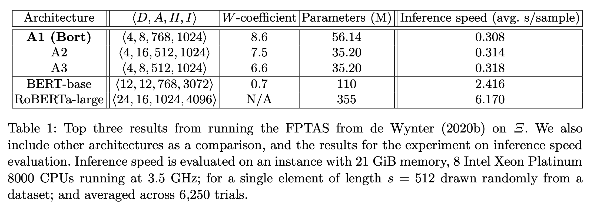
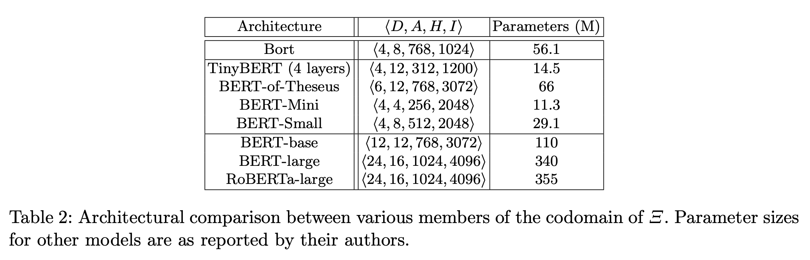
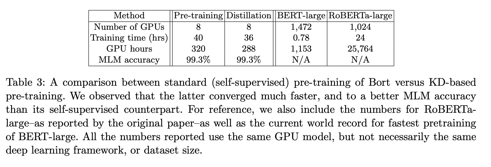

## Optimal Subarchitecture Extraction For BERT
### Adrian de Wynter and Daniel J. Perry
### [[arXiv](https://arxiv.org/pdf/2010.10499.pdf)]

**Whats New**
It extracts an optimal subset of architectural parameters for BERT by applying recent breakthrough in neural architecture search (FPTAS). And, this optimal subest "Bort" is further pre-trained and fine-tuned using knowledge distillation techniques by applying greedy algo "Agora" which combines data augmentation with teacher-student distillation. In all, with about 5.5% of the total parameters it is able to obtain performance improvement of 0.3 to 31% over BERT-large.

**How It Works**
It has three phases
1) Neural Architecture Search
2) Teacher-student distillation for pre-training
3) Fine-tuning using data-augmentation and distillation

**Neural Architecture Search**
* Fully polynomial time approximation search (FPTAS) is a technique that relies on optimizing the surrogates to i(.), p(.), and e(.) as i_cap(.), p_cap(.), e_cap(.). Where i, p and e are for inference speed, parameter size, and error rates.
* Search space for FPTAS was kept as following:
    * D = {2, 4, 6, 8, 10, 12}
    * A = {4, 8, 12, 16}
    * H = {512, 768, 1024}
    * I = {256, 512, 768, 1024, 3072}
* W-coefficient is optimized using the search, and results are as follow:
    

    
    <em>Source: Author</em>
    

* Parameters comparision are as below:
    

    
    <em>Source: Author</em>
    

**Pre-training Using Knowledge Distillation**
* For KD settings for MLM pretraining, following loss were used
    * MLM Loss
    * Distillation Loss: Cross Entropy between teacher and student layer (distillation temperature 0.2)
* Comparision of standard pre-training and KD-pre-training
    

    
    <em>Source: Author</em>
    

**Fine Tuning and Evaluation**
* Greedy algorithm Agora was used, which combines data augmentation with teacher-student distillation.
* As Agora was mainly designed for binary classification problem, with balanaced labelled data, some specific treatment has been undertaken to handle multiclass, regression, or label-imbalance problems.
* To finetune for COLA, an additional layer was added.
* Performance gain was achieved on GLUE/SuperGlue etc tasks.

