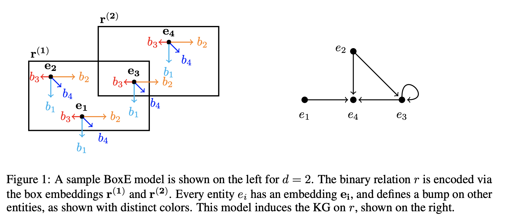
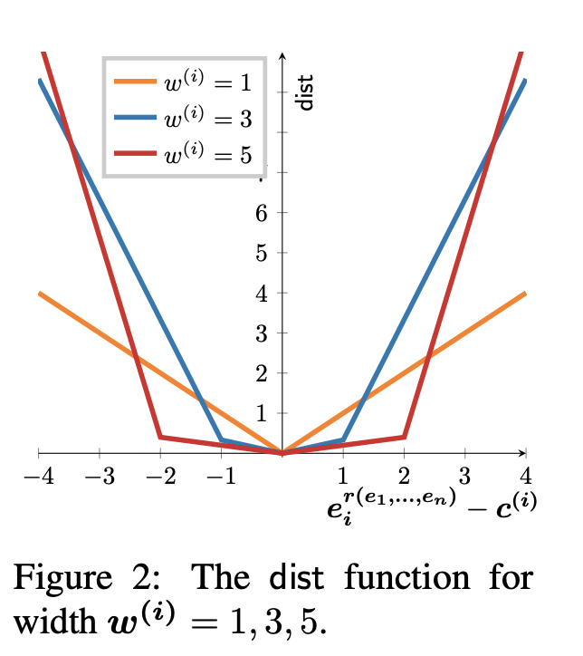

## BoxE: A Box Embedding Model for Knowledge Base Completion
### Abboud, Ralph, Ismail Ceylan, Thomas Lukasiewicz, and Tommaso Salvatori. 
### Advances in Neural Information Processing Systems 33 (2020).[[NIPS](https://papers.nips.cc/paper/2020/file/6dbbe6abe5f14af882ff977fc3f35501-Paper.pdf)]

**Whats Unique**
This paper presents a novel spatio-transational KG embedding technique, BoxE for knowledge base completion. BoxE can both capture and inject rules from rich classes of rich languages, and naturally applies to higher-arity relationships. 

**How Does It Work**
* Knowledge Base can be viewed as collection of facts of the form r(e1, e2, .. , en)
* KB is known as KG when all the relations are binary (composed of two entities).

* In BoxE, 
    * every entity e_i \in E is represented by two vectors. e_i, b_i \in R_d. 
        * e_i defines the base position and b_i defines its transational bump
        * The final embedding of an entity e_i relative to the fact r(e1, e2, .. e_n) is

        

    * every relation r is represented by n hyper-rectanges. boxes r(1), r(2), ..., r(n) \in R^d
    
* Following figure denotes, entitites base embeddings and bump, and box for each n-arity of relation.

    
    <em>Source: Author</em>
    

* Distance function: 
    * An entity embedding is adjusted with the translation bump
    * If it e_i is found in r(i) box, its good. With in box it recieves lesser penalty for being away from the center, but high penalty when it is out of the box. Following function capture this.

    

    * Following figure shows how distance function varies for different scenarios.
    
    

    
    <em>Source: Author</em>
    

* Objective function to minimise is:

* It has outperformed other KG embeddings like TransE, RotateE, ComplEx, DistMult etc