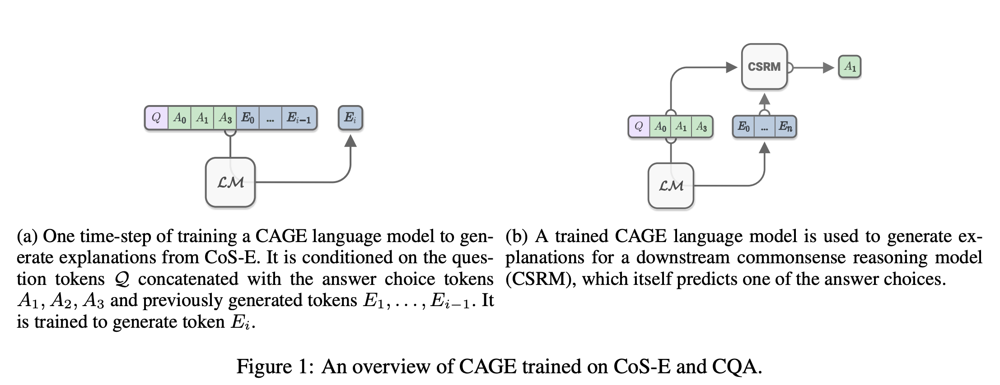
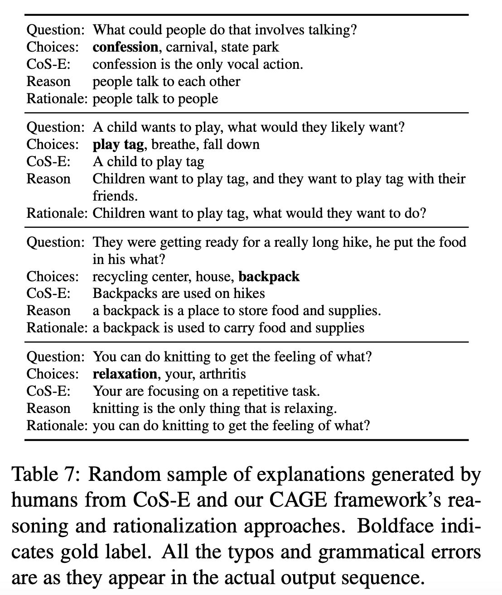

## Explain Yourself! Leveraging Language Models for Commonsense Reasoning
### Nazneen Fatema Rajani, Bryan McCann, Caiming Xiong, Richard Socher
### 2019, [[arXiv](https://arxiv.org/pdf/1906.02361.pdf)]

**Whats Unique**
This paper invented a model CAGE -  Commonsense Auto-Generated Explanation model, which first generates the explanations during training and inference, and use them to enrich the context for the tasks of CommonSenseQA to outperform current SOTA by 10%.

**Major Contribution**
* Introduce a new CommonSense Explnations (CoS-E) dataset to study commonsense reasoning
* A new method CAGE for automatically generating explanations and using it for CommonSenseQA to achieve SOTA peformance
* Explanation transfer on two out of domain datasets.

**Overview**
* Following figure provides an overview of the system.

    
    <em>Source: Author</em>
    

**Results**
* Baseline: 63.8
* Human explanations during training only: 65.5%
* LM generated explnations during both training an inference: 72.2%
* Human explnations during training and validation [Oracle - as while generating explanations, user have already seen the answer]: 89.8%

**Reasoning & Rationale**
* It also validates two setups, 
    * explain-and-then-predict (Reasoning)
    * predict-and-then-explain (Rationalisation)
* Examples of explnaitons used for reasoning, and they are produced as part of rationalisations are as follow:

    
    <em>Source: Author</em>
    

**Out-of-domain Transfer**
* Same language model have been used for out-of-domain transfer learning setup for datasets like SWAG, and Story Cloze. 
* And, it found that there is a small decrease in the peformance when we added explanations.

