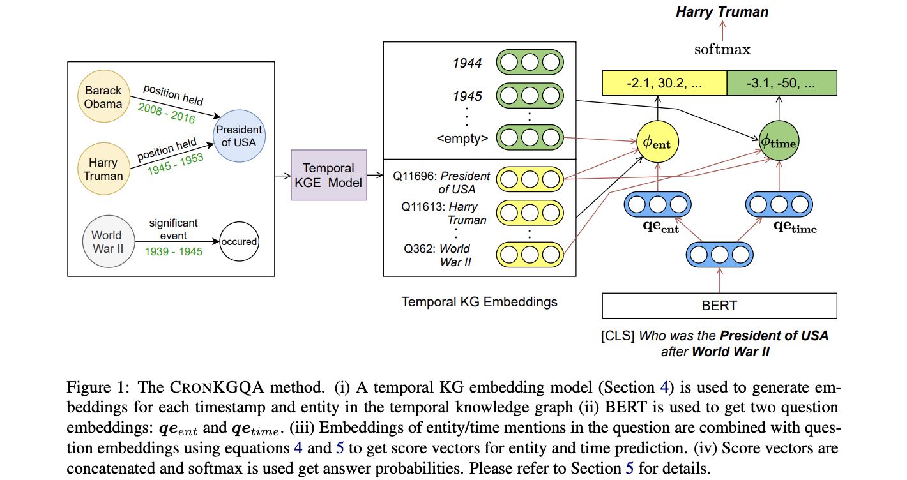

## Question Answering Over Temporal Knowledge Graphs.
### Saxena, Apoorv, Soumen Chakrabarti, and Partha Talukdar
### [[arXiv](https://arxiv.org/pdf/2106.01515.pdf)].

**Whats Unique**
This paper present question answering task over temporal knowledge graph. It has also created the temporal KG heuristically.

**How It Works**
* ComplEx is popular KG embedding method, which represents each entity e as a complex vector u_e \in C^D. Given subject entity s, object entity o and relation in between r, it has the score \phi for the fact as below:

*  TComplEx, TNTComplE: It is an extension of ComplEx, where each timestamp t is also represented as vector w_t. So, the score of the claimed fact (s, o, r, t). 

* Core Idea: 

    * Architecture diagram can be seen as below:
    

        
        <em>Source: Author</em>
        

    * Using TComplEx, temporal KG embeddings are learned. 
    * Fact sentence embeddings are derived using pretrained language model, like BERT. Afterwards, it is projected to the vector space of TComplEx, and treated as relation embeddings.
    * Entity Scoring Function: Temporal KG embeddings of subject entity and timestamp, and relation embeddings derived above, are used, and score is derived over all possible entities.

        

    * Time Scoring Function: Temporal KG embeddings of subject and object entities, and relation embeddings derived above are used, and score is derived over all possible times. 

        

    * It outperfoms other baseline methods which are not using temporal KG embeddings significantly.