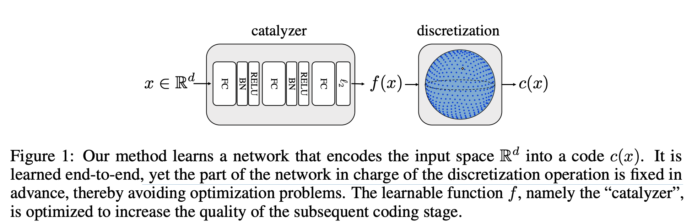
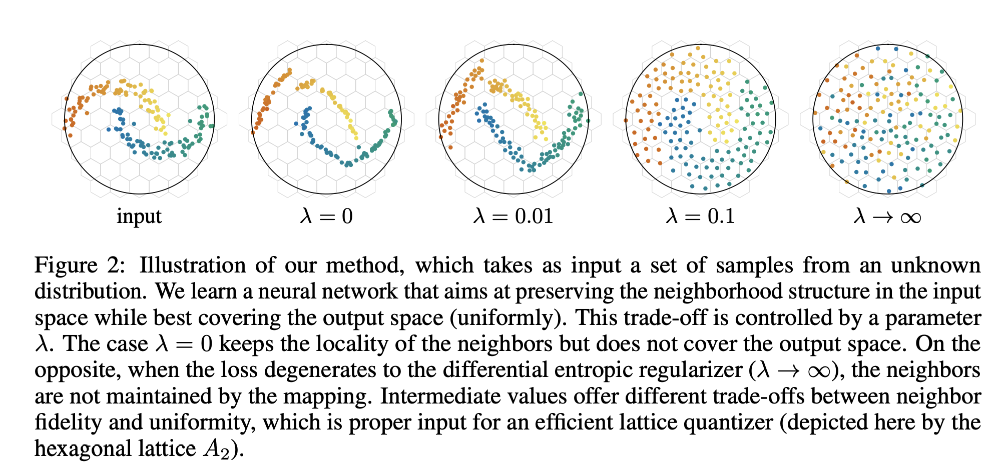

## Spreading vectors for similarity search.
### Sablayrolles, Alexandre, Matthijs Douze, Cordelia Schmid, and Hervé Jégou.
### arXiv preprint arXiv:1806.03198 (2018) [[PDF](https://arxiv.org/pdf/1806.03198.pdf)].

**Whats Unique**
Generally, parameters of quantizers are learned from the data. In this work, authors reverse the paradigm and adapt data to quantizer. As a proxy objective, a NN was designed and trained favouring uniformity in the sperical latent space, while preserving the neighbourhood.

**How It Works**
Following figure shows how input is transformed to uniform sperical space and preserving the neighbourhood.

    
    <em>Source: Author</em>
    

Authors uses following methods for the same:

* KOLEO: DIFFERENTIAL ENTROPY REGULARIZER: This is used to spread the points uniformly. Differential entropy, minimum distance from all the other points is used as the proxy, and that is been maximized. 

$\rho_{n, i}=\min _{j \neq i}\left\|f\left(x_{i}\right)-f\left(x_{j}\right)\right\|$

$\mathcal{L}_{\text {KoLeo }}=-\frac{1}{n} \sum_{i=1}^{n} \log \left(\rho_{n, i}\right)$

* RANK PRESERVING LOSS: Triplet loss is used for the same.  Which can be written as follow:

$$\mathcal{L}_{\text {rank }}=\max \left(0,\left\|f(x)-f\left(x^{+}\right)\right\|_{2}-\left\|f(x)-f\left(x^{-}\right)\right\|_{2}\right)$$

Final loss is sum of both KoLeo and Rank Loss. 

Illustration of how the balance between uniformity of the output distribution and the neighbourhood is understood from the following figure.

    
    <em>Source: Author</em>
    

* Lattice based discritization is used, where a point is representated by the closest point in the lattice.

* 95.5 recall @ 100 is achieved with just 64 bits, and its effectiveness over LSH and ITQ methods are demonstrated.

