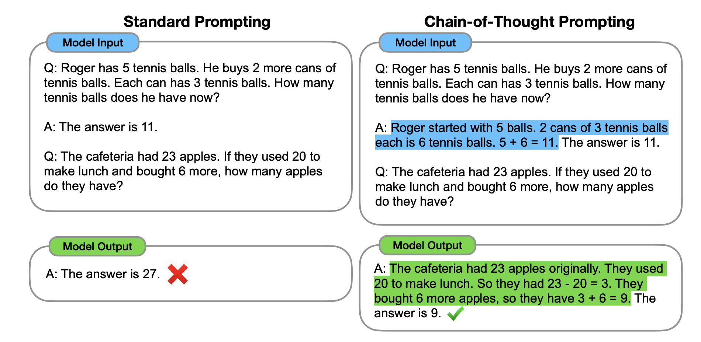
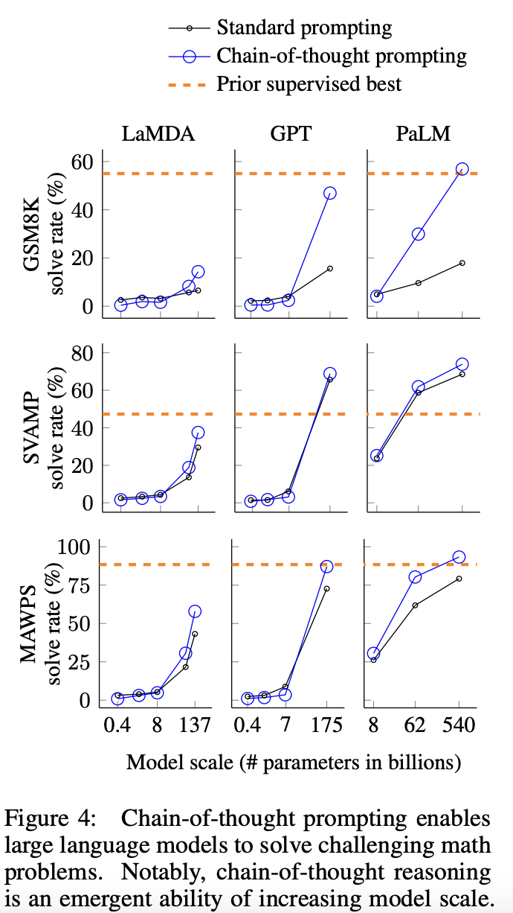

## Chain-of-thought prompting elicits reasoning in large language models.
### Wei, Jason, et al. 
### Advances in Neural Information Processing Systems 35 (2022): 24824-24837. [PDF](https://proceedings.neurips.cc/paper_files/paper/2022/file/9d5609613524ecf4f15af0f7b31abca4-Paper-Conference.pdf)

**Key Points**
* This paper present the effectiveness of chain of thought reasoining with few shots learning. It significantly improve the reasoning ability on tasks like mathematical reasoning, symbolic reasoning, and commonsense reasoning.
* Interestingly, the improvement get better with bigger LLMs (noticable after 30B parameters). So, its emergent propery of LLMs.
* Chain of thought based reasoning is robust with different annontators.
* It is better than just putting intermediate equations, variables etc basic techniques.
* It still has a limitation that the reasoning could go on wrong path, its more evident on smaller LLMS and two major error cases are either missing step or semantic understanding error. 
* This does not require fine tuning at all, so its effective from development time, but since its effective on big LLMs - it has computational limitations.
* The technique is expalined in the following figure:

    
    <em>Source: Author</em>
    

* Scaling effectiveness with LLM parametric size is as below:

    
    <em>Source: Author</em>
    
