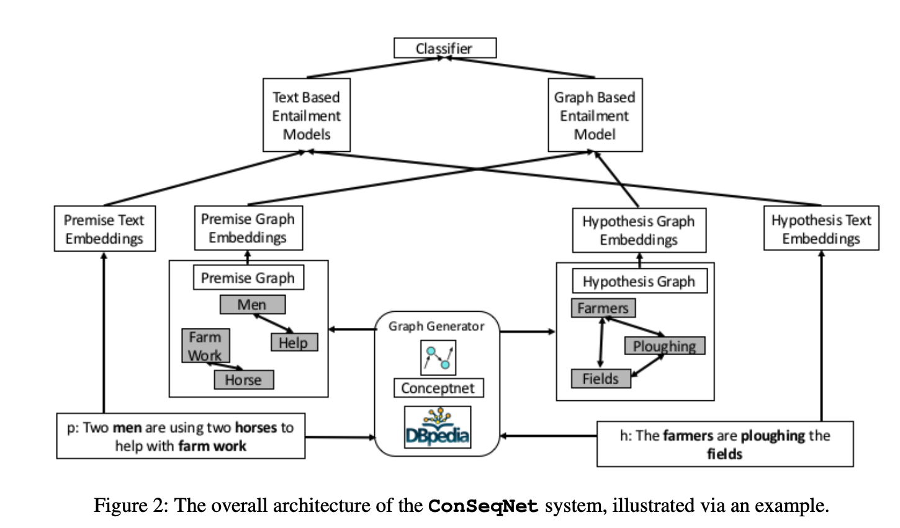

## Improving Natural Language Inference Using External Knowledge in the Science Questions Domain
### Xiaoyan Wang, Pavan Kapanipathi et al
### AAAI-19 [[arXiv](https://www.aaai.org/ojs/index.php/AAAI/article/view/4705)]

**Whats New**
This paper presents a way to incorporate external knowledge base of Natural Langauge Inference tasks. And, it manages to achieve state of the art results.

**How It Works**
* Following figure illustrates the approach.
    

        
        <em>Source: Author</em>
        

* It ensembles two models, text based entailment and graph based entailment models.
* It uses wordnet, conceptnet and dbpedia as its external knowledge soruces
* Text Based Entailment Model
    * It uses glove embeddings as input
    * BILSTM model for contexulisation of premise and hypothesis
    * It computes word-by-word attention between hypothesis and premise
    * Then it computes "soft-aligned-premise" by taking weighted sum of premises token embeddings based on its attention to hypothesis
    * it concatenate hypothesis representation, soft-aligned premise representations, their differnce, and their element wise product.
* Graph based entailment model
    * It computes subgraph of external knowledge base by considering only concepts occured in hypothesis or premise, and one-hop, and two-hop (with condition of path existance) as two other methods to construct subgraphs.
    * It computes soft aligned premise, and soft aligned hypothesis as well.
    * for each token in premise, it concatenate its represenation, soft aligned representation of hypothesis, and subtraction, and pair wise multiplication
    * similarily, for each token in hypotheis, it concatenate its representation, soft aligned repr of premise, subtraction and element wise multiplication.
    * it takes average and max pool, and concatenate to create a fixed representation.

* A classifier takes concatenation of text-based-model and graph-based-model output and predict the output.

**Results**
* about 1%-2% improvement in the accuracy compared to prevision techniques with external knowlege.

