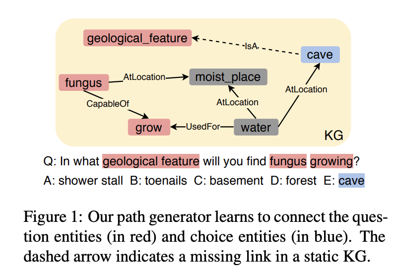
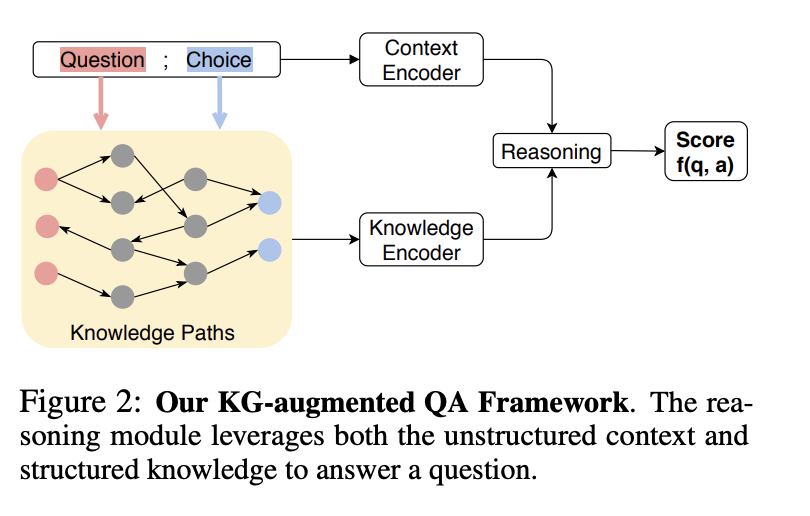

## Connecting the dots: A knowledgeable path generator for commonsense question answering.
### Wang, Peifeng, Nanyun Peng, Filip Ilievski, Pedro Szekely, and Xiang Ren. 
### arXiv preprint arXiv:2005.00691 (2020).

**Whats Unique**
This paper presents a knowledgeable path generator, and shows its utitlity in lifting the performance of NLP models for QA task. Given two entities from question and answer, it automatically generate a KG path, which may contain novel relations as well. 

To infuse a relevant portion of Knowledge Graph in NLP models, (1) it is important to contextualize and extract sub-graph or paths from the complete KG. (2) Generally, KG suffers from sparsity and incompleteness.

This research try to fill both the above gaps.

**Motivating Example**
Following figure demonstrate how KG can be relevant.

    
    <em>Source: Author</em>
    

**How It Works**

**Dynamic KG Path Generator**
* It fine-tune GPT-2 model to generate dynamic KG path as follow: Given "Tail Entity, [SEP], Head Entity", GPT-2 would generate a complete path from head entity till the tail entity.
* It fine-tune GPT-2 model using triples and multi-hop paths sampled from ConceptNet and ATOMIC commonsense KG.
* It extract the hidden representation of the tokens of the generated path, and aggregate it based on the attention of context (i.e. question and answer choice)

**KG Augmented Framework**
Following figure demonstrate how dynamic paths from KG can be augmented.

    
    <em>Source: Author</em>
    

Knowledge Encoder derives embedding k using following math. Where it is the weighted average of each paths embeddings using its attention with respect to context of question and answer.

**Results**
It improves the performance of CommonsenseQA and OpendomainQA using the KG augmentation with the help of dynamic kg path discovery.