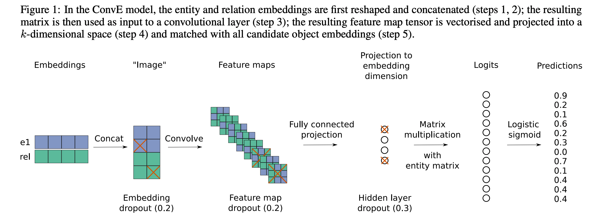

## Convolutional 2D Knowledge Graph Embeddings
### Tim Dettmers, Pasquale Minervini Pontus Stenetorp Sebastian Riedel
### AAAI 2018 [[arXiv](https://arxiv.org/pdf/1707.01476.pdf)]

**Whats New**
This paper offers a parsimonious multilayer convolutional network model for link prediction, which gives state of the art performance and also, it is particulary effective at modeling nodes with high indegree. 

**Major Contribution**
* Introduce a simple, competitive 2D convolutional link prediction model, ConvE.
* Developing 1-N scoring procedure that speeds up training.
* Parameter efficient model.
* Indegree, or pageranks denote the complexity of a graph. ConvE performs increasingly better on increasingly complex graphs.

**How It Works**
* Number of Interactions for 1D vs 2D Convolutions
    * 2D convolutions increases expressiveness in comparison to 1D convolution.

         

        

    * The same principle can be extended to alternating pattern.

        

    * 2D convolution with alternate patterns allow more interactions between a and b.

* Convolutional 2D Knowledge Graphs Embeddings
    * s, and o are subject and object, and related by relationship r.
    * A graph can be represented by tripplet (s, r, o)
    
        

    * es-dash and rr-dash are 2D representations of entity embedding and relation embedding
    * a convoltion function is applied, f, with kernel w, and output is tensor. c * m * n, where c is number of filters , and m * n depends on a kernal size and input size
    * it is flattened into a vector, and a projection in embedding for output entitity using W
    * then it is multipled, with e_o, to give a prediction score of the triplet (s, r, o)

    * Following figure best described this process:

    

        
        <em>Source: Author</em>
        

* Results
    * WN18: is a subset of WordNet which consists of 18 relations and 40,943 entities. Most of the 151,442 triples consist of hyponym and hypernym relations and, for such a reason, WN18 tends to follow a strictly hierarchical structure
    * FB15k (Bordes et al. 2013a) is a subset of Freebase which contains about 14,951 entities with 1,345 different relations. A large fraction of content in this knowledge graph describes facts about movies, actors, awards, sports, and sport teams.
    * YAGO3-10 (Mahdisoltani, Biega, and Suchanek 2015) is a subset of YAGO3 which consists of entities which have a minimum of 10 relations each. It has 123,182 entities and 37 relations. Most of the triples deal with descriptive attributes of people, such as citizenship, gender, and profession
    * FB15k-237: inverse relations removed from FB15k
    * WN18RR: inverse relations removed from WN18
    * On database where inverse relations are removed, link prediction performance achieves:
        * mean rank of around 4187 for WN18RR, 244 for FB15k
        * MRR of around 0.43 for WN18RR, and 0.32 for FB15K
        * 52% @ Hit10 for WN18RR, 50% @ Hit10 for FB15K

