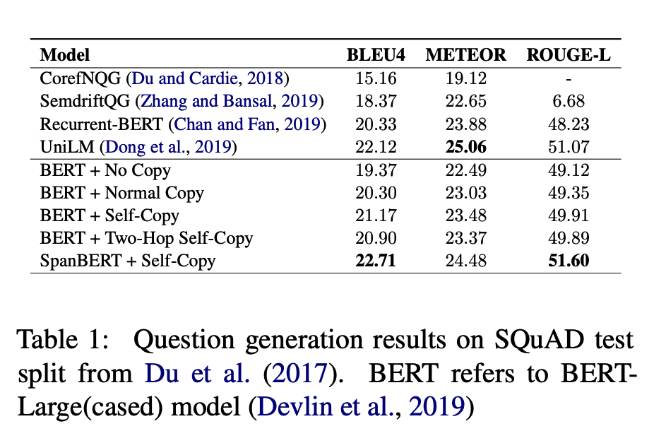

## CopyBERT: A Unified Approach to Question Generation with Self-Attention
### Stalin Varanasi, Saadullah Amin, Gunter Neumann
### ACL 2020 [[arXiv](https://www.aclweb.org/anthology/2020.nlp4convai-1.3.pdf)]

**Whats Unique**
This paper presents a copy mechnism, and how it can be effectively leveraged for the use case of question answering.

**How It Works**
* It finds a copy probability metrix for y_i th locaction over paragraph, answer and question generated till y-i-1th location.
    

    * probability that y_i is t_k token, its n x n matrix, but its valid only for valid target token, i.e. paragraph tokens and tokens generated till i-1.

    * P_a matrix is n x n matrix and it is generated with few strategies:
        * Normal Copy: Just depending on hidden representations of last layer, with weight parameters

            
            
            * W is hxh parameters matrix

        * Self-Copy: 
            * Cmompute weight of each attention head from hidden represenations of last layer, for each token. S is n x M matrix
            * For each token, get the weighted average of attention of that token with other tokens, consider that as the probabilities.

            

            * P_a matrix can be achieved by dropping middle dimension.

        * Two-hop:
            * Get another matrix of P_a, with different sets of parameters. Take square of it to get 2-hop probability. And consider original P_a as 1-hop probability, and get final probability as follow:

            

            * weight to rely on 1-hop and 2-hop probability is again computed from hidden repr of the current token

* It find a generative probabiliy over vocaboarly by transforming its last layer hidden representation of previous token over vocabolary of size V

    

    * Where, V \in R ^ h x |V|
    * h_qi-1 \in R ^ h x 1

* It learns a flag to rely on copy or generated probability, by transforming of last layer hidden representation of previous token 

    * where w \in R ^ h x 1

**Results** 
* Results are as below, along with the ablation study.
    

        
        <em>Source: Author</em>
        
