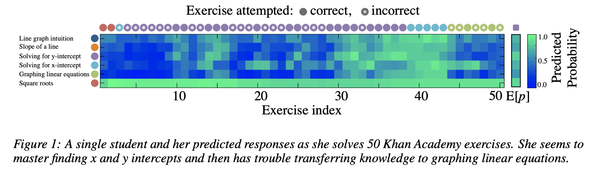
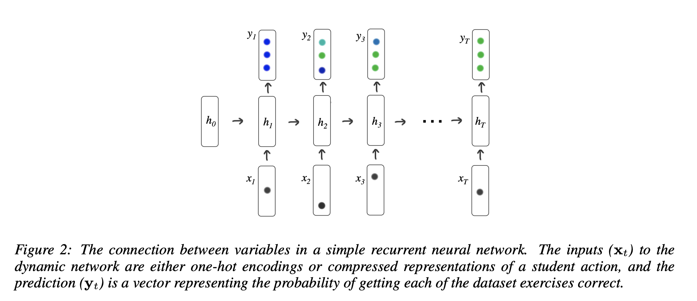
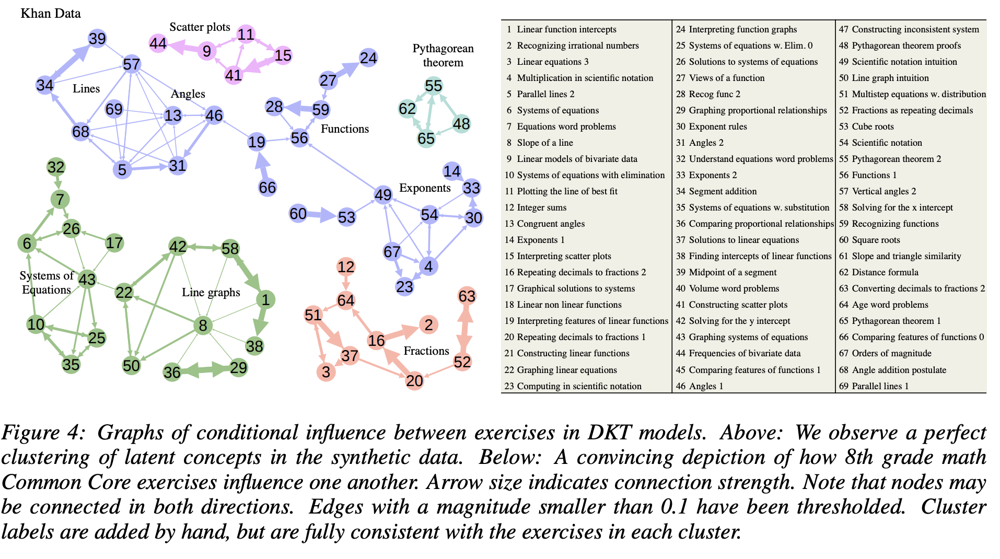

## Deep Knowledge Tracing
### Piech et al
### 2015,  [NILPS](https://proceedings.neurips.cc/paper/2015/file/bac9162b47c56fc8a4d2a519803d51b3-Paper.pdf)

**Whats Unique**
This paper formulate and implement the problem of knowledge tracing using LSTM, and demonstrate the new SOTA benchmark.

**How does it work**
* Problem Illustration is shown in the figure below. Where on about 50 excercies, student's correctness was given, and each stage, the knowledge state of studen over all the concepts were computed.

    
    <em>Source: Author</em>
    

* Inputs: 
    * M unique exercise, input is one hot encoding of {q_t, a_t}
    * If M is too large, random projections of k-sparse data of d dimensions on k*log(d) can be used. 
    * Output vector y_t is length of the number of problems. 
* Simple network can be defined by following equations
    
     

* LSTM can be used as well. 

    
    <em>Source: Author</em>
    

* Objective function for loss can be computed as below:

    

    * Notice, prediction of answer a_t+1 on question q_t+1 is dervied based on the output at q_t.

* AUC of 0.86 is achieved. 

* Content structure was discovered based on the sensitivity caused by exercise on each other. 1.4 millions of Khan academy exercise was used for about 45K students over 69 different types of exercise (concepts)

    
    <em>Source: Author</em>
    

