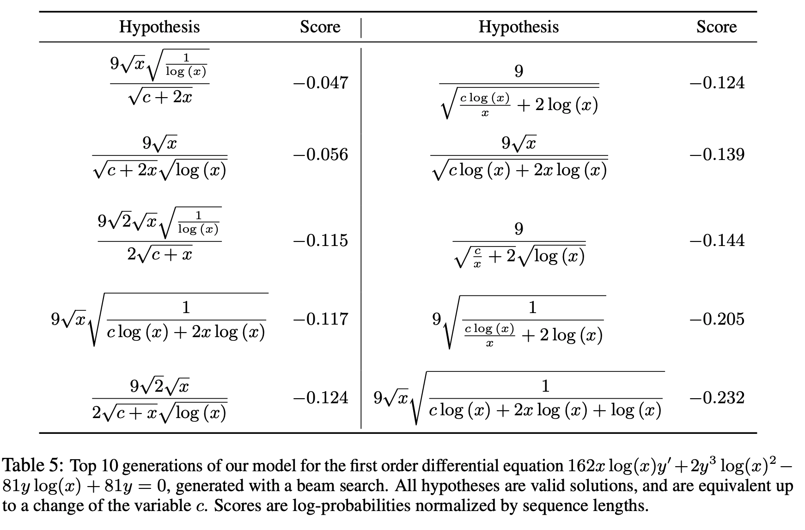
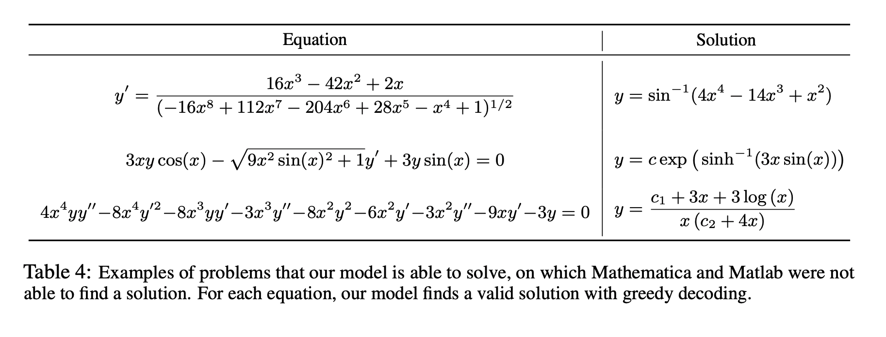

## Deep learning for symbolic mathematics.
### Lample, Guillaume, and François Charton. 
### arXiv preprint arXiv:1912.01412 (2019).

**Whats Unique**
This paper has generated problems for integration, and differentiation and shows how transformer model is able to solve them effectively. It experiments on various beam sizes, and shows how accuracy is better.
**How Does It Work**
* This paper establishes that neural networks are surprisingly good at solving complex math problems like Integration and Differentiation.
* It choes pre-fix notation to generate the output
* It also shows, model is really good to generate diverse set of expressions which are all the same mathematically.
    

    
    <em>Source: Author</em>
    

* It also able to solve the problems which SymPy or other such framework would not be able to, or will get time out. Such examples are as below:
    

    
    <em>Source: Author</em>
    
