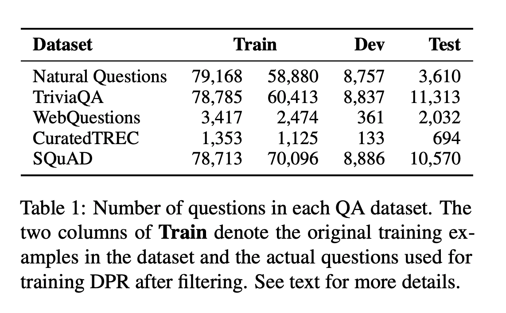
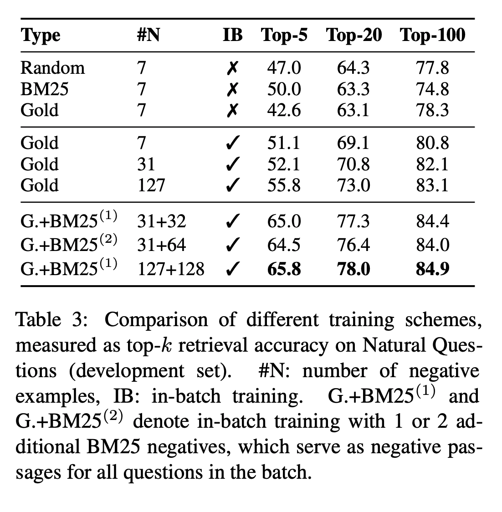

## Dense Passage Retrieval for Open-Domain Question Answering
### Karpukhin, Vladimir, Barlas Oğuz, Sewon Min, Ledell Wu, Sergey Edunov, Danqi Chen, and Wen-tau Yih.
### [[arXiv](https://arxiv.org/pdf/2004.04906.pdf)]

**Whats Unique**
This paper presents that dense vector retrieval can effectively outperform sparse vector (i.e. BM25, TFIDF etc) retrival in open domain question answering, where in key techniques to train DPR are "in-batch negatives", and "top BM25 retrieved candidate". It also present QA on retrieved paragraph using span selection and paragraph selection approach, that outperforms current benchmarks.

**How It Works**
* Datasets considered: Following table captures what all datasets are considered.

* Key Concepts in fine tuning retriver:
    * In Batch Negatives: For a batch of size B, each question i has a relevant passage i as the positive instance, and all other passages B-1 are as the negative instances.
    * One hard negative, i.e. top results from BM25 system can also be added.
    * BERT was fine tuned using the loss function to train DPR and CLS token was used as its embedding.
        
    
    * FAISS system was used to retrieve the passages using their embeddings.
   
* Results and Ablation Study
    * Retrieval systems result can be seen as below:
    

    
    

    * Comparative study of different training schemes are as follow: As we can see, in-batch negatives, with one hard negative using BM25 gives the best result
    

    
    

* End-to-end Question Answering:
    * Probability of span, and probability of passage selection are computed as below:
    * P_i is i-th passage, where it has LxH size, where L is number of tokens and H is embedding dimensions
    
    * End-to-end QA has also outperformed other systems, and gives accuracy of about 40-50% on different datasets.

