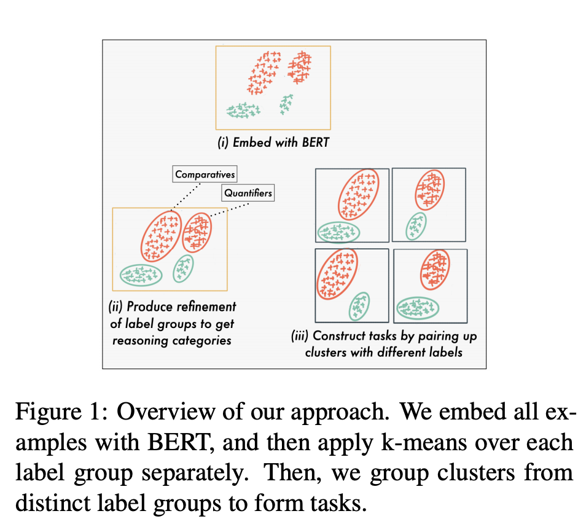

## DReCa: A General Task Augmentation Strategy for Few-Shot Natural Language Inference
### Shikhar Murty,  Tatsunori B. Hashimoto, Christopher D. Manning
### 2020 [[arXiv](https://openreview.net/pdf?id=PqsalKqGudW)]

**Whats Unique**
One classic bottleneck of current deep learning systems is that it considers the dataset as the task and hence suffers from the ability to generalize. Thoughtfully crafted meta-learning system can be helpful here.

A good read on a possible meta-learning setup from Prof Manning's team, where K^N (where k is latent clusters, and N is a number of labels) datasets are created from the original one to better represent task-based learning, rather than dataset based learning.

**How It Works**
* Following figure gives overview of the approach

    
    <em>Source: Author</em>
    

* Interestingly, it validates its hypothesis on a artificially generated datasets of sinewave, and then apply it on the real NLI datasets. 

* It uses BERT to get embedding representations, and used K-means to cluster in K-clusters. After which K^N datasets are created for meta-learning setup.