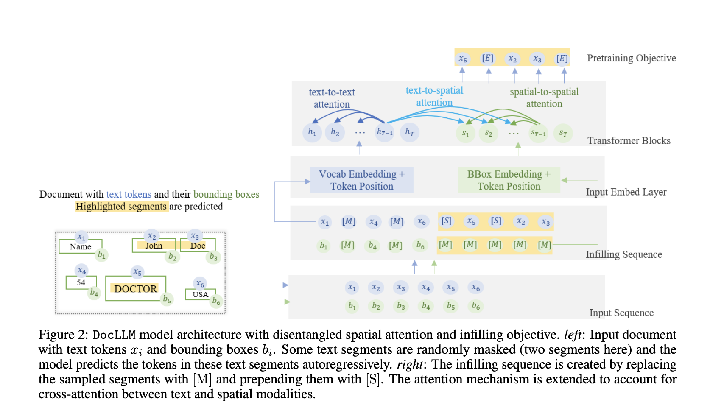

## "DocLLM: A layout-aware generative language model for multimodal document understanding."
### Wang, Dongsheng, et al.
### arXiv preprint arXiv:2401.00908 (2023) [[PDF](https://arxiv.org/pdf/2401.00908.pdf)

**Key Points**
- Current LLMs GPT3.5, Llama, Falcon etc accepts text-only inputs or assume the documents have consistent layouts.
- Multi-modality deals with different forms of data like text, images, sound etc.
- Common characteristic of visual document is hetrogenous content, irregular layouts, and disjoint text segments. 
    - in such scenario, next token prediction objective could be restrictive. Hence, 
    - Adopting cohesive blocks for text that account broader context
    - Infilling objective 
- Multimodalities in terms of handling spatial layouts and associated text semantics hasnt been explored entirely. 
- Spatial layout information is incorporated through OCR bounding box, it makes model capable of various document intelligence tasks.
- There are two major ways to incorporate spatial information
    - concatanating spatial and textual inputs
    -  Treating spatial info as the distinct modality, and compute its inter-dependency with text modality in dientangled manner. 

Summary of the congtribution is
- A light weight extension to LLMs designed for understanding visual documents
- A dientangled spatial attention mechanism that captures cross attention between text and layout modalities.
- An infilling pre-training objective.
- Instruction-tuning data set for visual document intelligence tasks.
- Comprehensive experiements and insights for model behavior.

LLM Architecture
- Token and their bounding box are given as input
- Some segments are sampled, and their tokens and bounding boxes are masked.
- Autoregrressive prediction of those masked samples is being made
- Attentions between inputs and bounding boxes are used to explot multi modality
- Following figure gives detailed illustration

p align="center">

<em>Source: Author</em>

- Instruction finetuning makes it outperform SoTA models on doc intelligence tasks