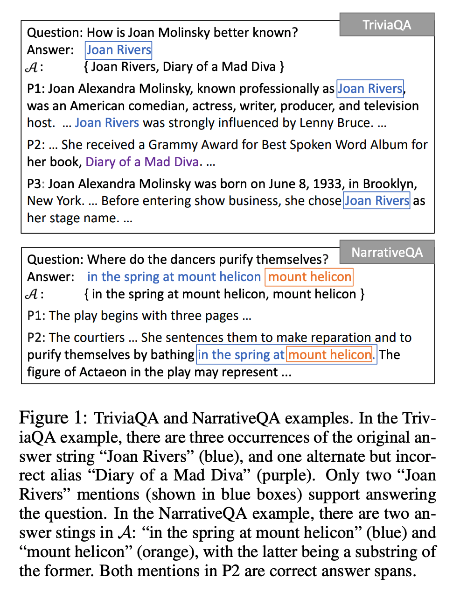
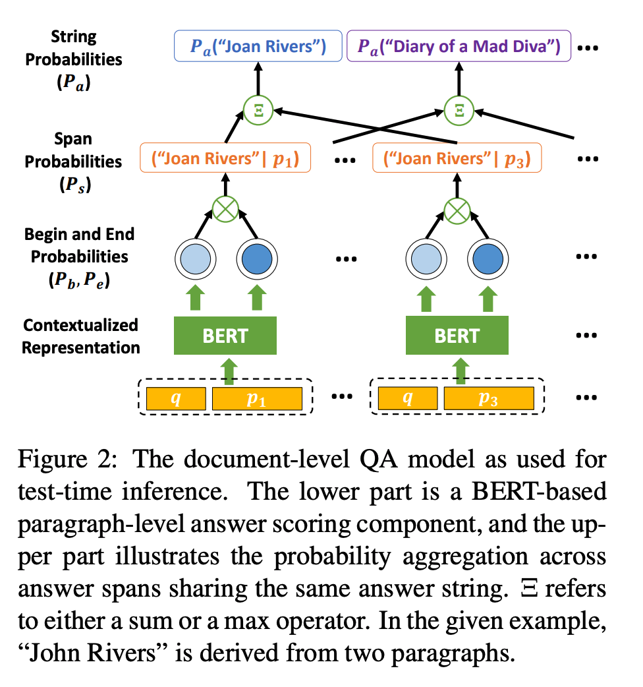

## Probabilistic Assumptions Matter: Improved Models for Distantly-Supervised Document-Level Question Answering.
### Cheng, Hao, Ming-Wei Chang, Kenton Lee, and Kristina Toutanova. 
### arXiv preprint arXiv:2005.01898 (2020).[[arXiv](https://arxiv.org/pdf/2005.01898.pdf)]

**Whats Unique**
This paper presents validation of different hypothesis, when probabilities for answer is computed over a span, over a paragraph or over a document. And how it is sensitive to distant supervision, where labels are not of higher accuracy.

**Motivating Example**

    
    <em>Source: Author</em>
    

**Architecture**
* Span probabilities are converted into answer probabilities by varying the scope, i.e. paragraph, or document, with operations like max, or sum. 

    
    <em>Source: Author</em>
    

**Hypothesis**
* Three different hypothesis are experimented:
    * H1: All A-consistent answer spans are correct.
    * H2: Every positive paragraph has a correct answer in its A-consistent set.
    * H3: The document has a correct answer in its A-consistent set YA. 

* Under above hyptothesis, it has normalised the score for paragraph level or the document level. And, it is seen that H3 at the document level gives the most accurate performance.

