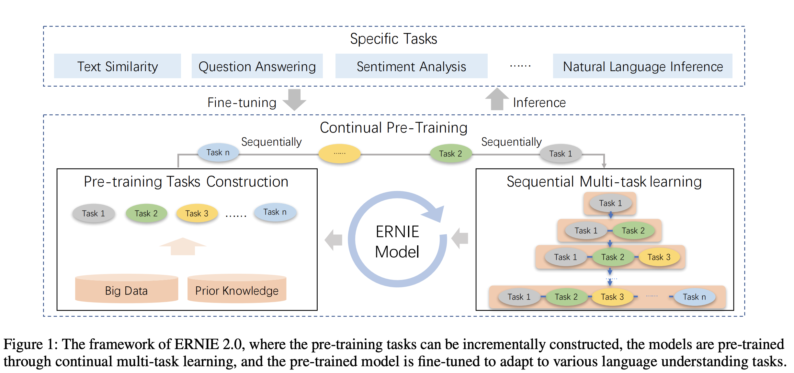
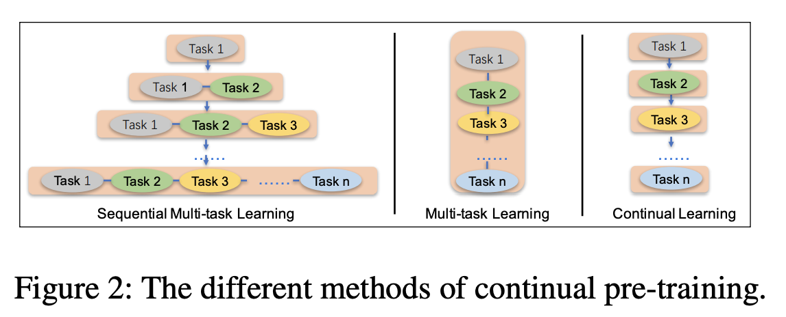

## ERNIE 2.0: A Continual Pre-Training Framework for Language Understanding
### Yu Sun, Shuohuan Wang, Yukun Li, Shikun Feng, Hao Tian, Hua Wu, Haifeng Wang
### AAAI 2020

**Whats New** This paper tries to leverage lexical, syntactic and semantic information present in unlabelled corpus during pretraining with a continual multi-task learning supporting multiple objectives during pre-training.

**How It Works**
* Instead of training on smaller pre-training objectives, It would consistently introduce a large veritey of pre training tasks to help model efficiently learn the lexical, syntactic and semantic rempresentations. 
* Following figure illustrate it really well.

    

        
        <em>Source: Author</em>
        

    

        
        <em>Source: Author</em>
        

* As shown above, how continual pre training is different. Where a new task is added sequential, and it is given more weightage in training.

* Task embeddings are also added so that model can differentiate its paramters optimisations for different tasks

* Following different kinds of pre-training objectives were used:
* Word-aware Pre-training Tasks:
    * Knowledge Masking Task: Phrase masking, and named entity masking. 
    * Capitalization Prediction Task: Capital words usually stores semantic information compared to other words.
    * Token-Document Relation Prediction Task: This task predict whether the token in a segment appears in other segment of the original document.
* Structure-aware Pre-training Tasks:
    * Sentence Reordering Task: a given paragraph is randomly split into 1 to m segments and then all of the combinations are shuffled by a random permuted order. We let the pre-trained model to reorganize these permuted segments, modeled as a k-class classification problem.
    * Sentence Distance Task: a 3-class classification problem. ”0”: two sentences are adjacent, ”1”: two sentences are in the same document, but not adjacent, and ”2”: two sentences are from two different documents.
* Semantic-aware Pre-training Tasks
    * Discourse Relation Task: semantic or rhetorical relation between two sentence based on some open source data.
    * IR Relevance Task: search query and relevant title relationship. 

* Results:
    * There was about 2-3% accuracy improvement with respect to BERT for both base and large model.
    * Limited comparitive study showing effectiveness of continual multi task training wrt of vanilla multi task training or sequential multi task training.

* Reflection: Ablation study could have been better to actually know where the impact comes from.