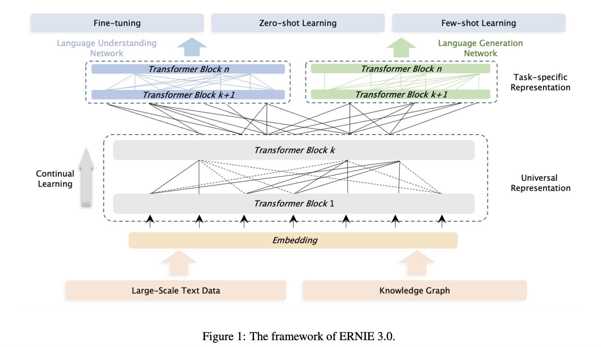
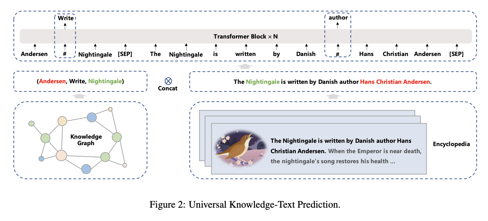

## ERNIE 3.0: Large-scale Knowledge Enhanced Pre-training for Language Understanding and Generation.
### Sun, Yu, Shuohuan Wang, Shikun Feng, Siyu Ding, Chao Pang, Junyuan Shang, Jiaxiang Liu et al.
### arXiv preprint [arXiv:2107.02137](https://arxiv.org/pdf/2107.02137.pdf) (2021).

**Whats Unique**
ERNIE 3.0 presents a novel pretraining method on both natural language text and explicit knowledge triples. It fuses both auto encoding and auto regressive settings, where both NLU and NLG sets of tasks are trained. The 10B parameters module outperforms on NLU and NLG tasks.

**How It Works**
* The backbone of ERNIE3.0 has both Universal Representation Module (48 layers) and Task-Specific Representation Module (12 layers). The pretraining architecture is as follow:

<em>Source: Author</em>

* 4TB pre-training data corpus is used, where along with a sentence knowledge graph triple is also fed. And, pre-training objectives like MLM can also uses knowledge triples, and knowledge objectives like entity or relationship detection can also use the context in the text. Following figure explains the approach:

<em>Source: Author</em>

* Following pre-training tasks where used to train the model:
    * Word Aware Tasks:
        * Knowledge masked language modelling ~ NLU
        * Document Langauge Modeling ~ NLG
    * Structure-aware Aware Tasks
        * Sentence Reordering
        * Sentence Distance
    * Knowlege Aware
        * Universal Knowledge-Text Prediction
* Pretraining 384 NVDIA v100 GPU cards and is implemented on PaddlePaddle framework
* It uses memory optimization (parameter sharding) to handle GPU running out of memory.. 

* It outperforms on NLU, NLU and KG-Intensive tasks.

