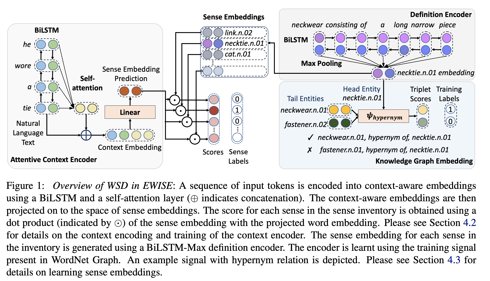

## Zero-shot Word Sense Disambiguation using Sense Definition Embeddings
### Sawan Kumar, Sharmistha Jat, Karan Saxena, Partha Talukdar
### ACL 2019

**Whats New** This paper delivers SOTA performance on Word Sense Disambigution by leveraging word senses from concept-net using knowledge graph embedding, and projecting contextualized word representation to sense embedding space.

**How It Works**
* Following figure illustrate end to end approach
    

    
    <em>Source: Author</em>
    

* Contextualized word representation is derived using Bi-LSTM with attention, and it is projected to sense embedding space.
* Sense embedding is derived from definitions of word, and using relations from concept net leveraging knowledge graph embedddings. ConvE or TransE techniques are used. Als, for definition based sentence encoding, differnt techniques like InferSent, USE, BERT, ELMO etc are used.

**Results**
* SOTA results proves the efficiency of learning sense embedding and projecting contextualised word rerepsenation in the space of sense embeddings.
* On rare and unseen word, it has also done better then all the method
* Interestingly, authors have also shown analysis on rare sense. Where it outperforms too.
* And, with lesser annotated data, performance gets only marginally impacted.

