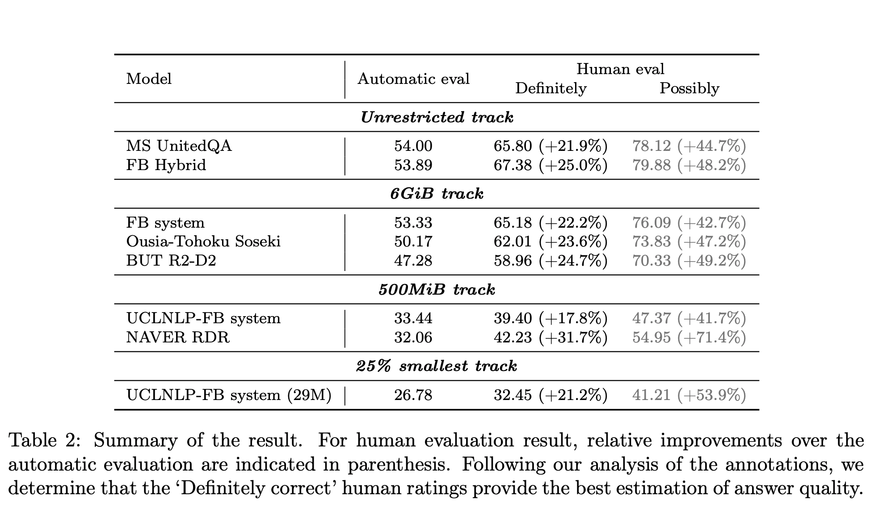

## NeurIPS 2020 EfficientQA Competition: Systems, Analyses and Lessons Learned.
### Min, Sewon, Jordan Boyd-Graber, Chris Alberti, Danqi Chen, Eunsol Choi, Michael Collins, Kelvin Guu et al. 
### arXiv preprint arXiv:2101.00133 (2021). [[arXiv](https://arxiv.org/abs/2101.00133)]

**Whats Unique**
This paper presents a deep dive analysis on various submissions into EfficientQA (open domain question answering)  analysis of different categories. All the top submissions uses retrieval corpus and neural question answering model.

**How It Works**
* There were four categories in EfficientQA competion:
    * Unrestricted
    * 6 GiB track
    * 500 MiB
    * Smallest Track

**Top Systems: Unrestricted**
* MS United QA: 
    * Retrieval: BERT based dense retriever to fetch top 100 relevant passages, from English wikipedia dump
    * Readers: Hybrid approach, both generative (T5) and extractive (ELECTRA) readers. 
    * Additional Techniques used for Extractive readers:
        * Posterior Differntial Regularisation: Cheng, H., X. Liu, L. Pereira, et al. Posterior differential regularization with f-divergence for improving model robustness, 2020.
        * Improved Loss Term: Cheng, H., M.-W. Chang, K. Lee, et al. Probabilistic assumptions matter: Improved models for distantly-supervised document-level question answering. In Proceedings of the 58th Annual Meeting of the Association for Computational Linguistics, pages 5657–5667. Association for Computational Linguistics, Online, 2020.
    * Additional Techniques used for Generative readers:
        * Adversarial Training: Ju, Y., F. Zhao, S. Chen, et al. Technical report on conversational question answering, 2019
        * Attention Bias: Lewis, M., M. Ghazvininejad, G. Ghosh, et al. Pre-training via paraphrasing, 2020
    * Re-ranking:
        * Combines generative and extractive reader to give final answer.
* FB Hybrid:
    * Retriever:
        * Dense Passage Retreival: Karpukhin, V., B. Oguz, S. Min, et al. Dense passage retrieval for open-domain question answering. In Proceedings of Empirical Methods in Natural Language Processing. 2020.
        * Generation Augmented Retrieval: Mao, Y., P. He, X. Liu, et al. Generation-augmented retrieval for open-domain question answering. arXiv preprint arXiv:2009.08553, 2020.
    * Reader
        * Fusion In Decoder with T5 Large:
            * Izacard, G., E. Grave. Leveraging passage retrieval with generative models for open domain question answering. arXiv preprint arXiv:2007.01282, 2020.
**Top Systems: 6GiB**
* Baseline
    * Only passage related to training corpus: 1.6M passages instead of 21M
    * Additional Pre-training with Salient Span Masking on T5: Guu, K., K. Lee, Z. Tung, et al. REALM: Retrieval-augmented language model pre-training. In Proceedings of the Conference on Machine Learning. 2020.
* FB System: 
    * Dense Retriever: Trained by distilling the cross attention score of the reader - Izacard, G., E. Grave. Distilling knowledge from reader to retriever for question answering, 2020
    * Reader: Fusion-in-Decoder: Izacard, G., E. Grave. Leveraging passage retrieval with generative models for open domain question answering. arXiv preprint arXiv:2007.01282, 2020
    * Compressing Dense Vector: Izacard, G., F. Petroni, L. Hosseini, et al. A memory efficient baseline for open domain question answering, 2020.
    * Compression using lrzip: https://github.com/ckolivas/lrzip
* Ousia-Tohoku Soseki:
    * FAISS for dense vector indexing
    * Reader: Reading Comprehension based on Electra-Large
    * Compression using ZPAG. 1http://mattmahoney.net/dc/zpaq.html
* BUT R2-D2:
    * Dense Retriever: RoBERTa trained via DPR objective.
    * Retrieve 400 passages from the pruned wikipedia.
    * Re-ranker selects top 20 passages from top 400 using longformer.
        * Beltagy, I., M. E. Peters, A. Cohan. Longformer: The long-document transformer. arXiv
    * Objective of extractive question answering: 
        * Fajcik, M., J. Jon, S. Kesiraju, et al. Rethinking the objectives of extractive question answering.
    * Generative Decoder: 
        * Fusion-in-Decoder

* Systems in other category might not be too useful, as they were compute and resource restricted.

* Results are shown as below:

    
    

