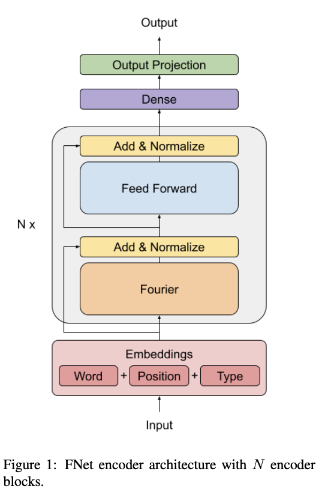

## FNet: Mixing Tokens with Fourier Transforms.
### Lee-Thorp, James, Joshua Ainslie, Ilya Eckstein, and Santiago Ontanon.  
### [arXiv preprint arXiv:2105.03824](https://arxiv.org/pdf/2105.03824.pdf).

**Whats New**
This paper has demonstrated that huge performance gain of attention based language models are due to its intermixing of tokens. Even if simple non-parameterized intermixing is done, it achives 92% accuracy, with lower memory footprint and 7 times the training speed over GPUs.

**Key Contributions**
* Attention mechanism works best because it does task dependent and token dependent intermixinig

* Intermixing tokens in sequence and hidden dimensions even in non-parameterised way would retain majority performance gain, and make model extremely fast.

* **FNet encoder** replaces self attention layer with a fourier sublayer, defined as follow: (1) a weight of token is sum over all the tokens of previous layer with weights derived from fourier transform. (2) fourier sublayer is applied over hidden dimension and then over sequence length.   

    

        
        <em>Source: Author</em>
        

* They have trained another model, **Linear encoder**, where self-attention layer is replaced with two learnable, dense and linear layer and it performs better than FNet, but ofcourse it has more parameters than FNet but lesser than vanilla BERT.

* Parameters, Loss, Accuracy over GLUE benchmark and GPU/TPU time per step has been published as results.

* For Long-Range Arena benchmark, its performance reaches almost on-par with BERT, which makes its suitable to apply at much lower memory footprint and higher speed.
