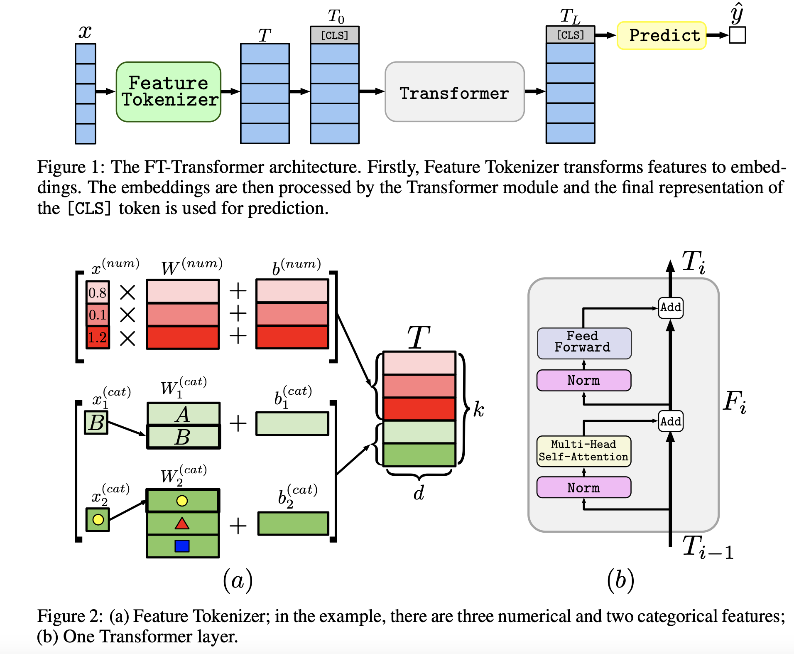

## Revisiting deep learning models for tabular data. 
### Gorishniy, Y., Rubachev, I., Khrulkov, V., & Babenko, A. (2021).
### Advances in Neural Information Processing Systems, 34, 18932-18943.

**Key Points**
* This paper suggets FT-tranformer architecture is quite good for tabular data, better than the tree based models. RESNET models also do comparatively good.

* FT in FT_transformer stands for feature tokenizer transformer.
* FT-transformer transforms all the features (numeric and categorical) to to embeddings and apply stack of transformer layers.
* It leverage CLS token for the final task, and also relative attentions to all the features are derived based on the CLS token.
* Following figure illustrate the input features transformation and the overall architeture.

    

    
    <em>Source: Author</em>
    

