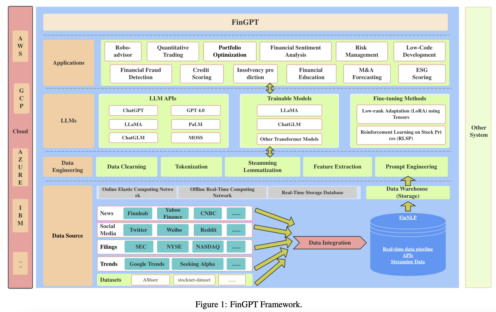

## FinGPT: Open-Source Financial Large Language Models.
### Yang, H., Liu, X. Y., & Wang, C. D. (2023).  [PDF](https://arxiv.org/pdf/2210.10723.pdf) 

Summary:

* FinGPT is an open source initiative for the end to end solution for applications powered by Finacial Large Langauge Models. 
* It consititutes following layers
    * Data Layer
        * Fundamentals: Company Filings and Announcements
        * Financial News 
        * Social Media Discussions
        * Trends
    * Data Engineering Layer
    * Modelling Layer
        * LLM APIs
        * Fine tuning 
    * Application
        * Robo-advisor 
        * Quantititative Trading 
        * Portfolio Optimization
        * Finacial Sentiment Analysis
        * Risk Management 

* End to end framework for FinGPT is as below:
    

    
    <em>Source: Author</em>
    

