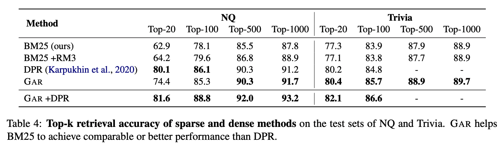

## Generation-augmented retrieval for open-domain question answering. 
### Mao, Yuning, Pengcheng He, Xiaodong Liu, Yelong Shen, Jianfeng Gao, Jiawei Han, and Weizhu Chen. 
### arXiv preprint arXiv:2009.08553 (2020) [[arXiv](https://arxiv.org/pdf/2009.08553.pdf)]

**Whats Unique**
Open Domain QA follows the approach of retriever + reader. The performance of reader is upper bounded by the performance of retriever. This paper presents ideas on how to improve the retrieval performance by augementing the query using generative language model techniques.

**How It Works**
* In a Retriever-Reader setup, GAR generate query context using pre-trained LM, and those context are used to retrieve documents. Following additional context are considerd:
* The default target (answer): pre-trained LMs are able to answer certain question solely by taking the questions as input and generating answers.
* Sentence containing the default target
* Title of the passage containing the default target

* In open-domain question answering, the final score is computed as: 

    * Where, D[i] is i-th retrieved document
    * Si[j] is jth span in docuemnt i

* These generated additional context are helpful in both sparse retrieval as well as DPR (dense passage retrieval), results are as below:

    
    <em>Source: Author</em>
    

