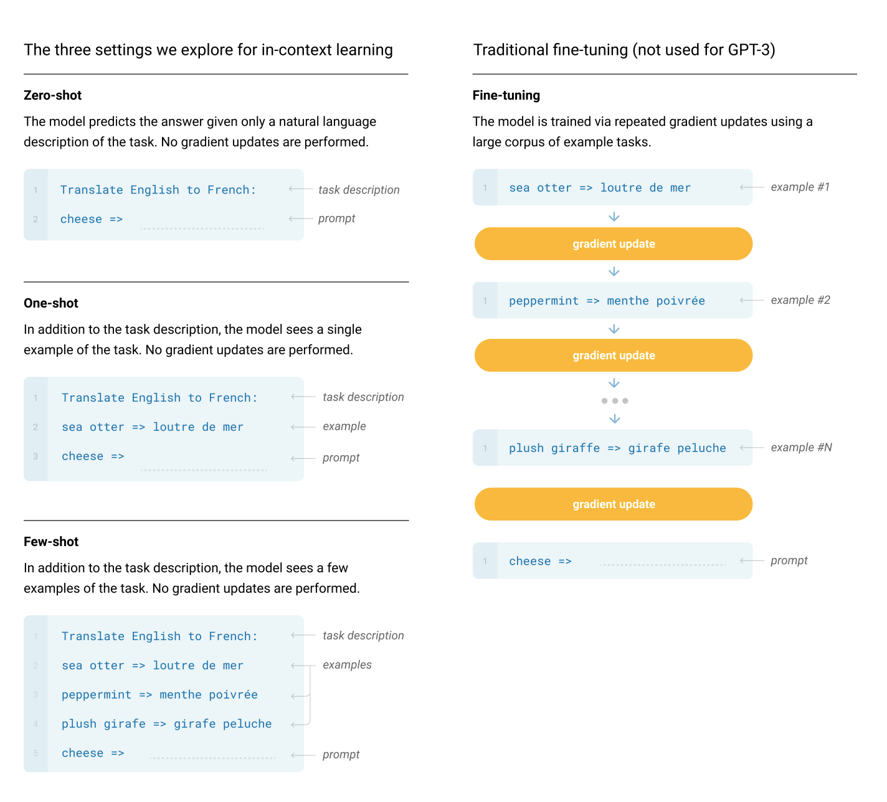

## Language Models are Few-Shot Learners
### Brown et al. OpenAI, 2020

* Scaling up language models greatly improves task agnostic, few shot performance. 
* GPT-3 has been trained for 175B parameters, which is 10X more than any state of the art.
* For all tasks, GPT-3 is applied without any gradient updates, or fine tuning with tasks, and few shot demonstration specified purely via text interaction with the model. 
* On top of NLP tasks like translation, question answering, cloze test, GPT3 can also be applied to several tasks that require on the fly reasoning, or domain adaptation such as
    * uncrambling words, 
    * using a novel word in sentence, or 
    * performing 3 digit arithmatic, etc
* Most importantly, GPT-3 can generate sample of news articles which human evaluators have difficulty distinguishing from articles written by humans.

* Pre-training + Fine-tuning approach can have following problems:
    * Need of labelled dataset for every new task limits the applicability of language model
    * potential to exploit suprious correlations in training data fundamentally grows with the expressiveness of the model and the narrowness of the training distribution.
    * Human do not require large datasets to learn most language tasks. And, adapatability to switch between many tasks and skills cant be found in today's NLP systems.
    * Meta learning - models develops a broad set of skills and pattern recognigion ability during training time, and use these abilities at inference time to rapidly adapt or recognize the desired task.

* GPT3 tests out three experiments:
    * Few shot learning (or in-context learning - allow as many demonstrations as will fit into model's context window, which is 2048, so around 10 to 100 examples can fit.
    * One shot learning - allow only one demonstration
    * Zero shot learning - no demonstrations are allowed, only an instruction in natural language. 
    * Gap between one, zero and few shot grows with parameters size. 

* GPT3 also struggles for some language inference tasks like ANLI, or reading comprehension RACE, or QuAC. 

    

    
    <em>Source: Author</em>
    

* Zero shot setting is the closest to how human operates.   

* Fine details on training
    * Adam with beta_1 = 0.9, beta_2 = 0.95 and epsilon = 10^-8
    * Clip gradient norm of gradient at 1.0
    * One cycle learning - warmup: 375 millions tokens, cosine decay over 260 billion tokens, and continue at 10% of original learning rate afterwards
    * gradually increase batch size from 32K tokens to full value over first 4-12 billions tokens
    * weight decay of 0.1 
    * n_ctx = 2048, context size, i.e. sequence length

* Limitations of GPT-3
    * GPT-3 samples still sometimes repeat themselves semantically at document level, start to loose coherence over sufficient long paragraphs, contradict themselves, and occasionally non sequitur sentences.
    * It focuses on in-context learning, experiments do not include bidirectional or denoising training objectives.
    * Limits of current pre-training objective, i.e. each token is equally improtant, lack customizing predictive objectives to entities of interest (i.e. T5)
    * Organizing diverse demonstration during pre-training, which could help in-context learning, and also independently stidy if few shot learning is just inference in-context or does it levearge some pre training distribitions.