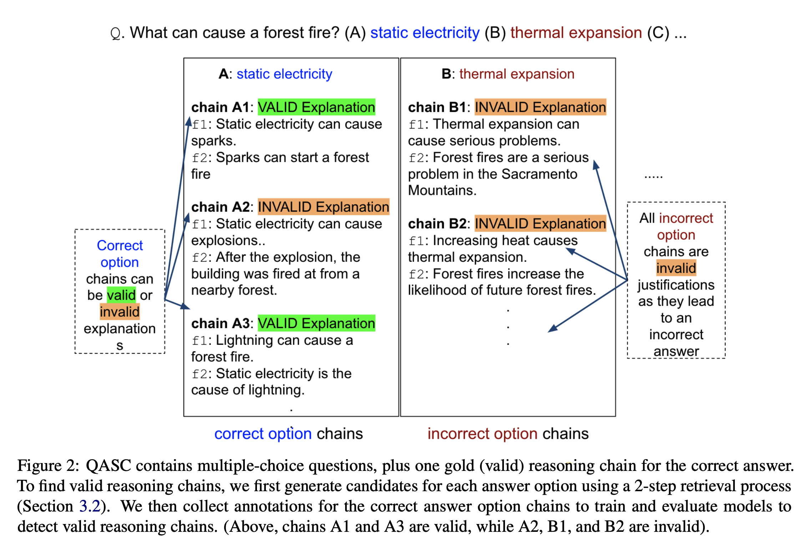
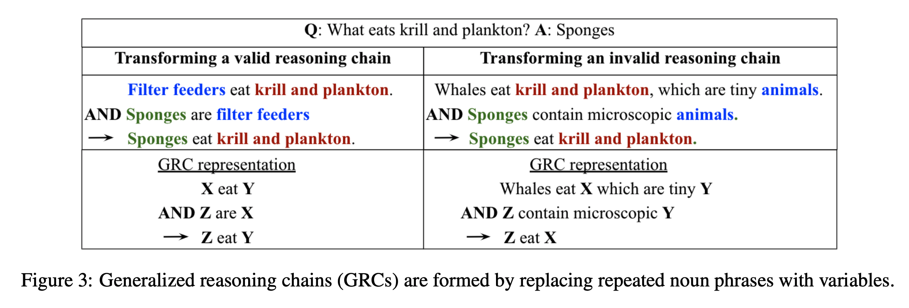
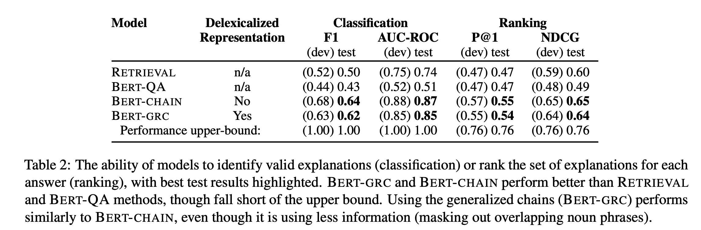
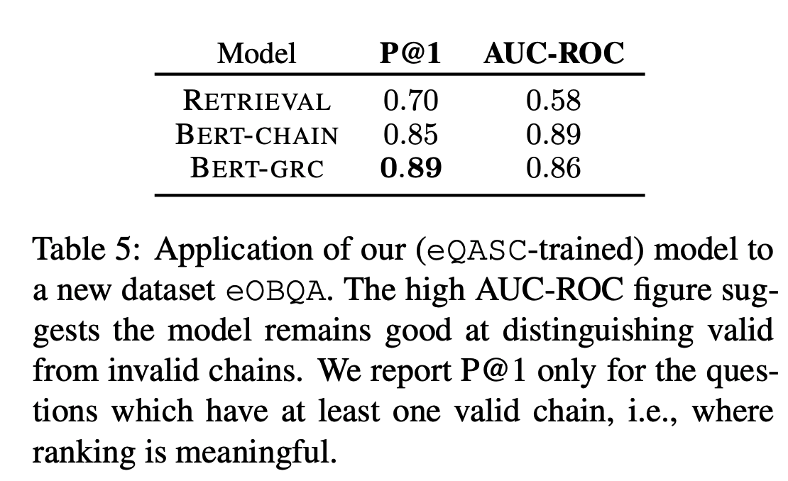

## Learning to Explain: Datasets and Models for Identifying Valid Reasoning Chains in Multihop Question-Answering
### Jhamtani, Harsh, and Peter Clark. 
### arXiv preprint arXiv:2010.03274 (2020)[[arXiv](https://arxiv.org/pdf/2010.03274.pdf)]

**Whats Unique**
This paper present an approach to generate multi-hop explanation (reasoning chain) from the context given question and answer. It is to explain human users that what are the supporting facts which led this decision making.

**How It Works**
* Authors contributed to three datasets
    * eQASC: containing annotations on over 98K candidate explanations for QASC dataset.
    * eQASC-perturbed: contains semantically invariant perturbations of a subset of QASC explanations. It is to measure the generality of explnation prediction models
    * eOBQA: adding explnation annotations to the OBQA test set, to further test the generality of the model trained on eQASC.

* Task Formulation
    * Reasoning chain of [s1, .., sn], and a final hypothesis H, and a valid reasoning chain as the one which entails hypothesis H.
    * C entails H if a person would reasonably conclude H given C.

    
    <em>Source: Author</em>
    

* Candidate Chain Construction
    * Search Query: Q+A, get facts F1 from corpus T
    * Search Query: F1: get facts F2
    * Remove pairs that do not contain any word from Q and A.
    * Select Top M pairs [f1, f2]

* Annotation:
    * Using candidate chains generated above, these were given to annotators, who marked if the reasoning chains were valid or not.

* Learning to Score chains:
    * Extract generalised reasoning chains (GRC) by removing repeated nouns which are tagged by part of speech tagging.

    
    <em>Source: Author</em>
    

* Model Training:
    [CLS] fact1 [SEP] fact2 [SEP] H => Binary Classification

    * BERT-CHAIN: Chains are passed as is.
    * BERT-GRC: Generalised chains are passed as input

* Metrics:
    * F1, AUC, P@1 etc are the metrics used.
    * One of the interesting metric which is used by the system is Normalised Discounted Cumulative Gain.

        
    
* Results:
    

    
    <em>Source: Author</em>
    

    * Results on generalised test-set eOBQA is as follows, where GRC has performed better
    

    
    <em>Source: Author</em>
    

