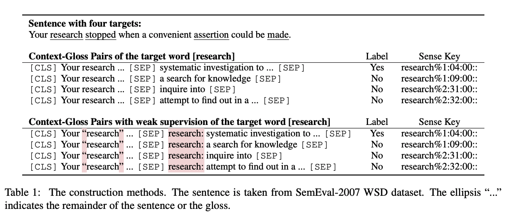

## GlossBERT: BERT for Word Sense Disambiguation with Gloss Knowledge
### Huang et al.,
###  ACL 2019 [[arXiv](summary/https://arxiv.org/pdf/1908.07245.pdf)]

**Whats New**
GlossBERT is a BERT trained on SemCor3.0 for word sense disambigution and validated with SemEval data. It achieves 77% overall accuracy on the SemEval test data.

**How It Works**
* Input is constructued as CLS <Context Sentence> SEP <Sense gloss> SEP. Few examples can be seen in the image below:
    

    
    <em>Source: Author</em>
    

* It has experimented with three options
    * Token CLS: A classifier is on token CLS
    * Sentence CLS: A classifier is on sentence CLS, i.e. the first token
    * Gloss BERT: A classifier is on the sentence CLS, and sentences are constructed with weak supervision.

* GlossBERT achieves overall accuracy of 77%.

