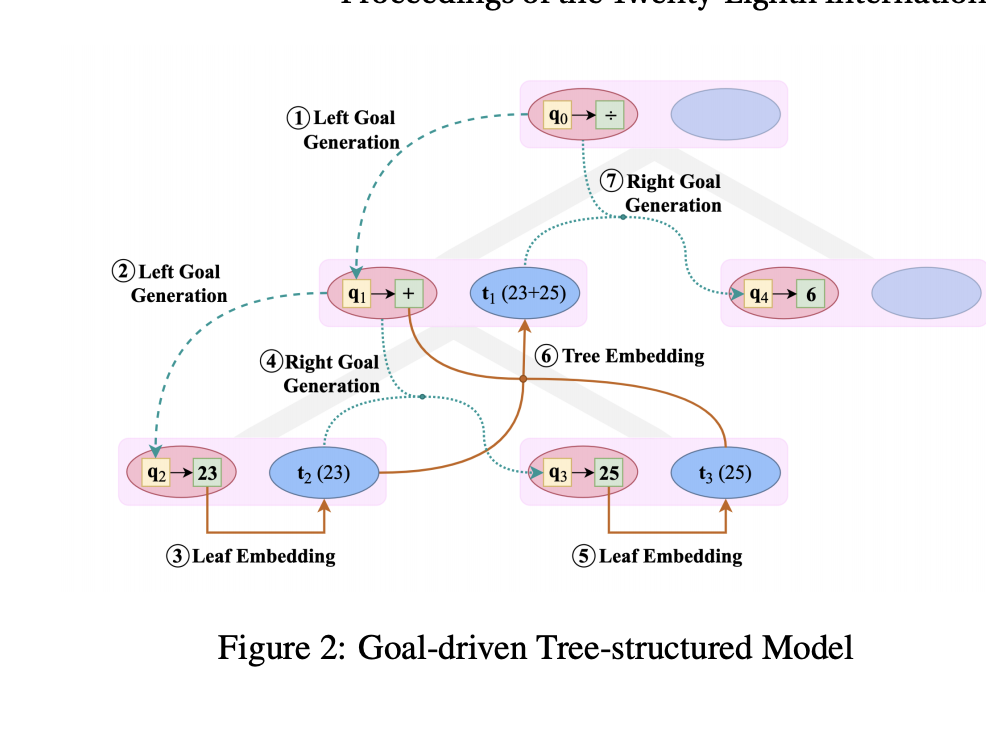
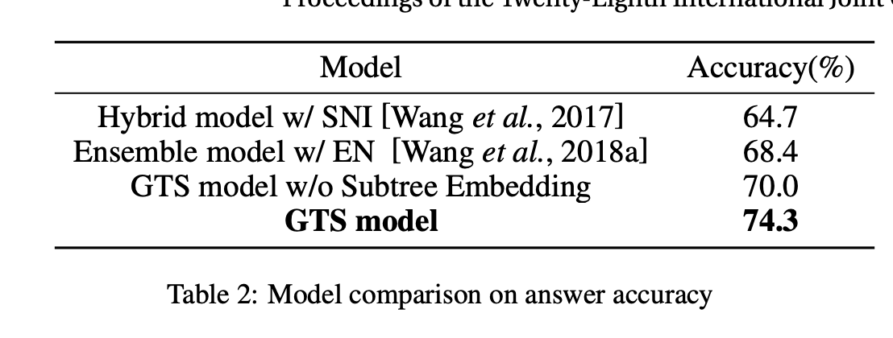

## A Goal-Driven Tree-Structured Neural Model for Math Word Problems
### Xie, Zhipeng, and Shichao Sun.
### In IJCAI, pp. 5299-5305. 2019. [PDF](https://www.ijcai.org/proceedings/2019/0736.pdf)

**Whats Unique**
It has a goal driven decomposition of the mathematical expression and decoder generates next token based on the parent and embeddings of sub-tree of its left sibling (if its the right sibling to a node). It limits its decoding vocaboloary and expression decomposition to make sure always syntactically correct output would be produced.

**How Does It Work**
* It has a Bi-directional GRU based decoder. 
* It limits its decoding vocabolury to numeric tokens n_p where p is positions, operators, and constants.
* It has the query vector, and it attend over encoded tokens to generate a context vector. 
* The probability of next token would be generated based on query, context, and the next token representation.

    

    * Where, q is the query vector or the current state. * if current token generated is an operator, then it would generated left tree. q_l would be derived using GRU in this case.

    

    * If current token is a numeber, then it falls back recursively, and right subtree would be generated. While generating right subtree, it would also consider the representation of left subtree generated so far, ie. t_l

    

* Following figure gives example of how decoding is done:

    
    <em>Source: Author</em>
    

* Over a simple linear decoder, goal driven decomposition has achieved a substantial improvement.

    
    <em>Source: Author</em>
    

