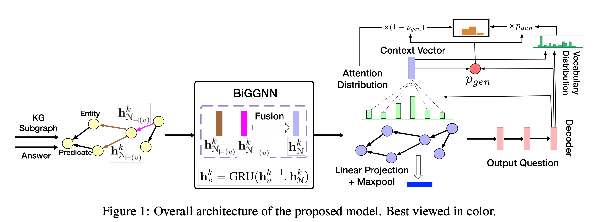

## Toward Subgraph Guided Knowledge Graph Question Generation with Graph Neural Networks
### Yu Chen, Lingfei Wu, Mohammed J. Zaki
### [[arXiv](https://arxiv.org/pdf/2004.06015.pdf)] 2020

**Whats Unique**
This paper proposes BiGGNN (Bidirectional Gated Graph Neural Network) based question generation from KG subgraph. It proposes Graph2Seq model for the same. 

**Main Contributions**
1. Propose Graph2Seq model for sub graph guided question generation from KGs.
2. Extended RNN decoder with a novel copy mechanism, that allow node attributes to be borrowed from KG subgraph.
3. Compare initialising node/relation embeddings when applying a GNN to process KG Subgraphs.

**Problem Formulation**
* Given KG subgraph G, and Answer Entity, we need to generate question Q which has the max conditional likelihood.

**Encoding Layer**
* Nodes and edges are intitialised with BiLSTM on GloVE embeddings of words making up the textual attributes. Authors believes that decoder would find it easy to generate questions given these hints.
* Leanrable answer markup vector is associated to each node/edge to indicate whether it is an answer or not.
* Initial vector representation of node/edge would be concatenation of BiLSTM output and the answer markup vector.

**Architecture**

        
        <em>Source: Author</em>
        

**BiDirectional Graph2Seq Generator with Copying Mechanism**
* BiDirectional Graph Encoder
    * Take average of incoming and outgoing neighbors and fuse it to get the representation of a node for the next hop. n number of hops is an hyperparameter.
    
    
    
    

* Handling multi-relational graphs: Following two possible ways
    * Levi graph transformation, where each edge is converted into a node. So, it will result a bipartate graph.
    * Gated message passing with edge information 
    

**Results**
* Ablation study on number of hops for GNN was also carried out.
* It has shown significant boost in BLEU score for question generation from KG on two dataset, WQ (WebQuestions) and PQ (PathQuestions)

