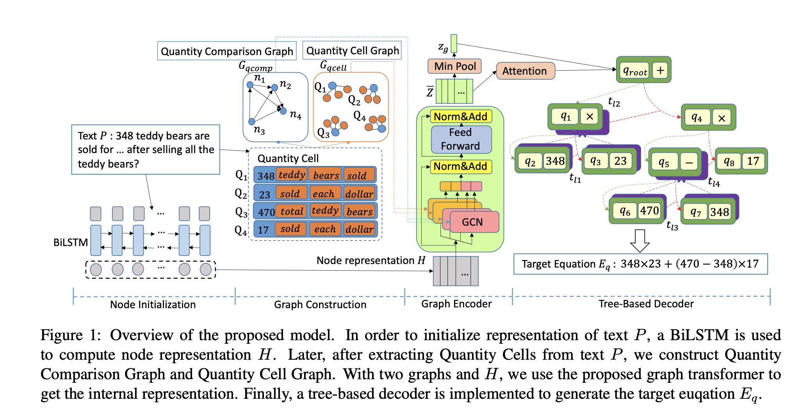

## Graph-to-tree learning for solving math word problems.
### Zhang, Jipeng, Lei Wang, Roy Ka-Wei Lee, Yi Bin, Yan Wang, Jie Shao, and Ee-Peng Lim. ["
### Association for Computational Linguistics, [ACL](https://ink.library.smu.edu.sg/cgi/viewcontent.cgi?article=6276&context=sis_research), 2020.

**Whats Unique**
This paper present a novel architecture where it has Graph Transformers as encoder and Tree preoder traversal decoder. It initialize embeddings for Graph Transformers using BI-LSTM. It uses Quantity Cell Graph, and Quantity Comparision Graph as two different kinds of graphs.

**How It Works**
* It uses BI-LSTM network to initialize embeddings for each tokens. 
* It extract quantities and tokens from the input math word problem
* Using dependency parse tree and POS tagging, it builds narrative words for each numeric quanity. This is Quantity Cell Graph.
* Using numeric order between quantity, it builds another graph, Quantity Comparision Graph
* It uses Graph Convolution Network in a setup similar to Transformers, with 4 heads, two head for Qunatity Cell Graph, and remaining two heads for Quanity comparision heads. Then it applys feed forward with residual connections.
* Tree Decoder decodes the output mathematical expression in the pre-order traversal.
* Tree decoder vocabolory only contains numerical quantities of the input, constants and operations.
* The figure of architecture diagram is as below:

<em>Source: Author</em>

* It outperforms other models on Math23K and MAWPS datasets.
