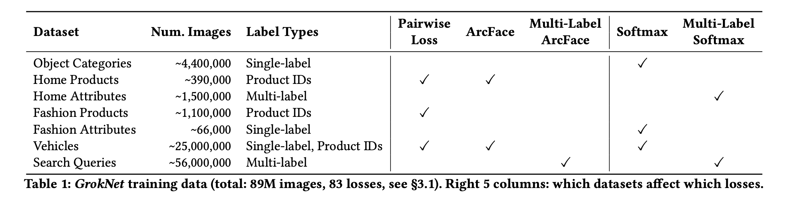
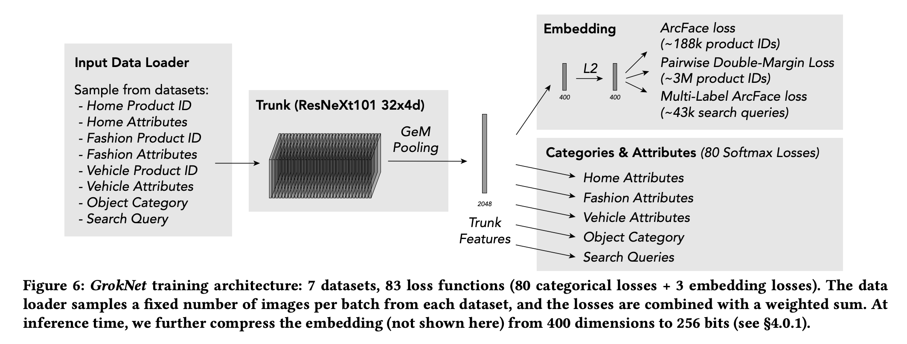

## Groknet: Unified computer vision model trunk and embeddings for commerce.
### Bell, Sean, Yiqun Liu, Sami Alsheikh, Yina Tang, Edward Pizzi, M. Henning, Karun Singh, Omkar Parkhi, and Fedor Borisyuk. 
### In Proceedings of the 26th ACM SIGKDD International Conference on Knowledge Discovery & Data Mining, pp. 2608-2616. 2020. [[PDF](https://ai.facebook.com/research/publications/groknet-unified-computer-vision-model-trunk-and-embeddings-for-commerce/)]

**Whats Unique**
Groknet is a image recognition system for computer applications developed with a unified model. It leverages multi tasking, weak supervision, distributed training, probabilities calibration, etc ML techniques to outperform other systems with 2x improvement in the performance. 

**How It Works:**
* It is trained on 7 datasets using 80 categorical losses and 3 embedding losses. 
* The final trained system analyses images to predict the following:
    * Object category: "bar stool","scarf", ..
    * Home attributes: object color, material, ..
    * Fashion attributes: style, color, ..
    * Vehicle attributes: make, model, ..
    * Search queries: text phrases for marketplace search
    * Image embedding: 256 bit hash used to recognize exact product, ..
* It is a unified model for several downstream applications.
* Following picture gives idea on datasets and loss functions being used:
    

    
    <em>Source: Author</em>
    

* Set of following ML techniques were used:
    * Weakly supervised data and data augmentation: Millions of unlabelled photos, auto object detection, embedding similarity with product ids
    * Marketplace search queries: text queries, and product ids where they have interacted with the seller.
    * GEM pooling: Generalised mean pooling, with a learnable parameter p, if p == 0, it reduces to average pooling, and p == infinity, it would become max pooling.
    * Softmax Losses: for 80 mutually exclusive groups, 80 loss functions
    * Multi label ArcFace loss: multi-lables per images, with angular margins in softmaxes
    * Pairwise double margin loss: extra margin on both positive and negative outliers. parameter $\alpha$ to balance between easy and hard examples
    * Distributed pairwise computation: negative and positive pairs from all the GPUs are collated and losses are computed for N^2 pairs.
    * Compressing embeddings: 400 dimensions (32 bit) to 256 bits using catalyzer.
    * Calibration: calibrated probabilities using isotonic regression.
    

<em>Source: Author</em>

