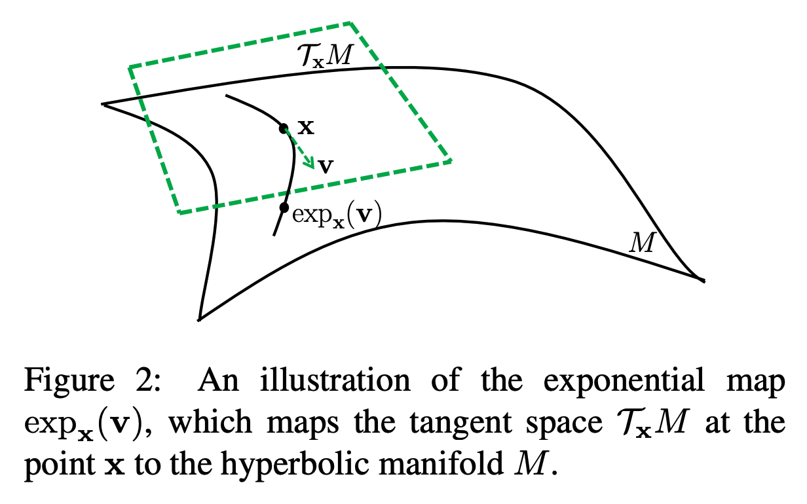

## Low-Dimensional Hyperbolic Knowledge Graph Embeddings
### Ines Chami, Adva Wolf, Da-Cheng Juan, Frederic Sala, Sujith Ravi and Christopher Re´
### ACL 2020 [[arXiv](aclweb.org/anthology/2020.acl-main.617.pdf)]

**Whats New**
* This paper present a method that combine hyperbolic reflections and rotations with attention mechanism to model complex KG relational patterns. 

**Main contribution**
* Train hyperbolic embeddings with relation specific curvatures to preseve multiple hierarchies in KGs
* parameterise hyperbolic isometries and leverage their geometric properties to capture relation's logical pattern such as symmetry or anti symmetry
* hyperbolic attention to combine geometric operators and capture multiple logical patterns.

**How it works**
* An illustration of a hyperbolic space and correponding tangential ecludian space is in below figure,
    

        
        <em>Source: Author</em>
        

* As can be seen in the figure, 
    * Tangent space maps to hyperbolic space with exponential map
    * Hyperbolic space maps to tangent space using logorithmic maps
    * x is presnet in both spaces, v is vector in ecludian/tangent space. Lets map it to hyperbolic space using exponential map, and vice versa.

         

    * Hyperbolic distance has following formula

        

    * It is similar to transforming it in ecludian space and measuring distance.

* Rotations and Reflections can be modeled as following:

    

    * Note these are diagnoal metrics
    * They are specific to relations r
    * Theta and Phi are learnable parameters.

* Hyperbolic attention:
    * Map x, and y in ecludian space. And compute attention scores. And compute weightage average using tangent space, which is mapped back to hyperbolic space using exponential map.

        

        

* ATTH Model
    * Rotation and reflection of head entity with relation r is taken.
    
    

    * Rotations and reflections are combined with attention mechanism

        

    * Distance between tail entity and transformed head entity is computed.

        

* Loss functipon: minimising full cross entropy loss with uniform negative sampling.

    

* Results
    * ATTH has got much better results in the lower dimension.
    * In higher dimension, even ecludian space can potentailly model hierarchies, so it is at par.
    

