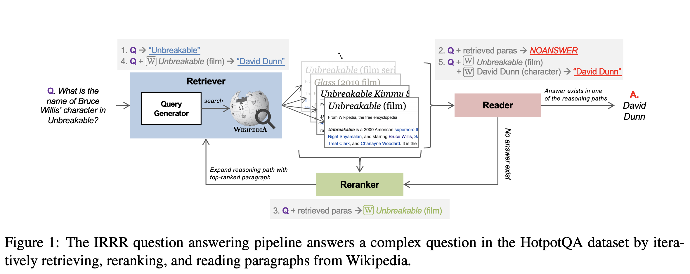
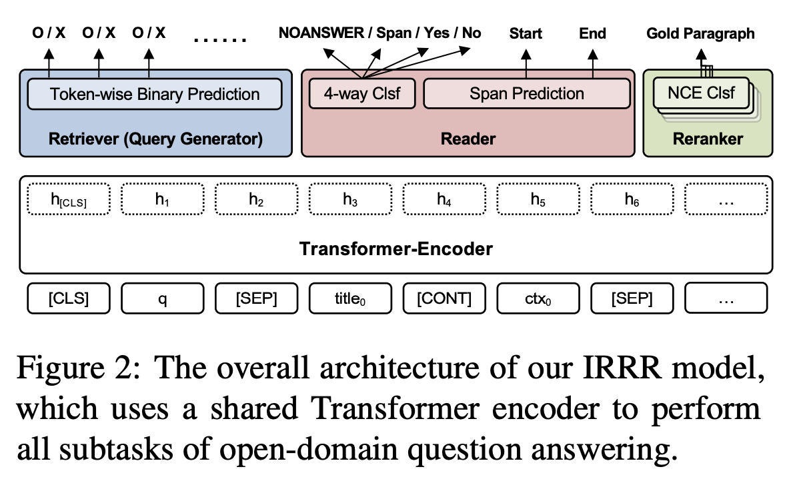

## Retrieve, Rerank, Read, then Iterate: Answering Open-Domain Questions of Arbitrary Complexity from Text

### Peng Qi, Christopher Manning et al. 
### 2020 [[arXiv](https://arxiv.org/pdf/2010.12527.pdf)]

**Whats Unique**
This paper present a single transformer based DNN model which can act as retriever, re-ranker, and reader to solve open domain question answering end to end. And, it is robust to generalise over 3-hop questions, even though it is not trained on for the same, thanks to its inherent architecture.

**Major Contribution**
* A unified DNN model that perfrom all essential sub tasks for open domain QA purely from the text.(retrieval, re-ranking, and reading comprehension)
* A new open domain QA benchmark that features different levels of complexity on an unified, uptodate version of wikipedia with newly annotated 3-hop questions.

**Illustration and Architecture**

    
    <em>Source: Author</em>
    

* Above figure illustrate the flow, query is formed from a question, answer is predicted from the current question and retrieved paras, documents are ranked and selected as the contexual paras for further steps.

* Following figure show multi-taks leanring setup of IRRR system

    
    <em>Source: Author</em>
    

**Supervised Training**
* Retriever
    * Overlapping spans between target paragraph and question and retrieved paragraphs are taken. 
    * Importance of each overalapped span is computed as follow: (t is target span)

        
    * Spans are sorted based on its importance and length, and highest one is considered as the oracle query.

* Reader
    * Four way classifer, NOANSWER, Span Yes, and No is trained.
    * And, a sperated span predictor for start token and end token is trained.
    * Answerability is log likelihood ratio between most positive predicted span and the NOANSWER prediction. 

* Reranker
    * Reranker select one of the retrieved paragraphs to expand the search query. 
    * CLS token with linear transformation is used for the same. 

**Results**
* It achieves state of the art performance, and also able to generalise well.

