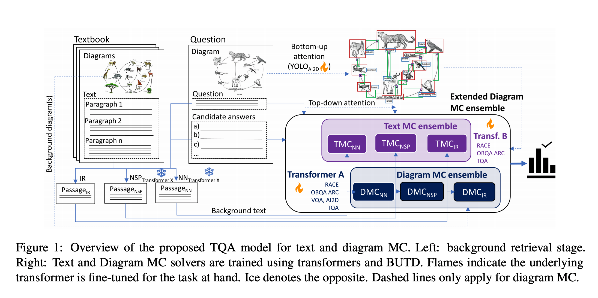
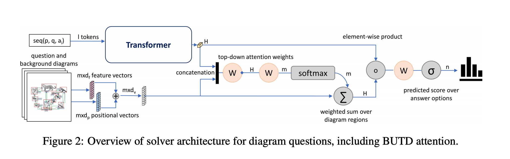

## ISAAQ--Mastering Textbook Questions with Pre-trained Transformers and Bottom-Up and Top-Down Attention.
### Gomez-Perez, Jose Manuel, and Raul Ortega. 
### [[arXiv:2010.00562](https://arxiv.org/pdf/2010.00562.pdf)] (2020).

**Whats Unique**
This paper presents the use of top-down and bottom-up attention by concatanating diagram and text representations in an ensemble setup to answer text book questions. 

TQA dataset consists of 1076 lessons, 78K sentences, 3.4K diagrams and 5400 boolq, 8293 text MC, and 12567 diagram MC Questions

It achieves SOTA results with accuracies of 81.36%, 71.11%, and 55.12% for boolq, text MC, and diagram MC questions.

**Approach**
Following figure illustrate the approach laid in the paper.

    
    <em>Source: Author</em>
    

As shown in the figure, there are three different retrievals are used to get the back ground knowledge to answer a question.

Using YOLO, regions and positions are derived, and they are intermixed using learnable transformations. Afterwhich, its top down attention is computed using the CLS representations of questions, answer option and background knowledge sequence. Attention weighted representations of diagram is computed.

Textual sequence representation, and attention weighed diagram representations are concatenated, and prediction is made using softmax layer. 

Following figure illustrate the complete approach.

    
    <em>Source: Author</em>
    

    