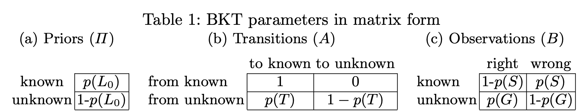

## Individualized Bayesian Knowledge Tracing
Models](summary/Individualised_BKT.md) 
### Michael V. Yudelson, Kenneth R. Koedinger, and Geoffrey J. Gordon, 
### CMU, [[Springer 2013](https://www.cs.cmu.edu/~ggordon/yudelson-koedinger-gordon-individualized-bayesian-knowledge-tracing.pdf)]

**Whats New**
This paper presents a systematic method for individualised BKT, where two parameters intial learning state and transition probabilities are individualised and compared with vanilla BKT. 

**How Does It Work**

BKT has mainly four parameters
* p(L_0): initial learning state
* P(T): Transition probability from unlearned state to learned state once user is given opportunity to apply
* P(S): probability of incorrect in learned state
* P(G): probability of correct in unlearned state, i.e. guessing

* Where P(C_t+1) is the predicted probability of a correct attempt at time t+1 on skill k by user u.

* This paper presents efficient way to backpropogate and learn parameters, where parameters are stored in matrix form

    
    <em>Source: Author</em>
    

* To successfully solve BKT problems, we need to solve two problems
    * Evaluation problem: given BKT parameters lambda = (Pi, A, B), and senquence of observations O = (o_t, t \in 1..T), what is the probability of that observations are generated from the given BKT model.
    * Learning problem: given BKT parameters lambda, and a sequence of observations, O, how should lambda be adjusted to maximise p(O|lambda)

* Results
    * KDD Cup 2010 dataset was used, where it had two datasets
        * Algebra 1: 8,918,054 rows of practive attempts by 3310 students, with more than 550 different skills.
        * The Bridge to Algebra: 20 million attempts for about 6,043 students, over about 900 distinct skills.

    * BKT model with individualised transition probability has given the best improvement.

