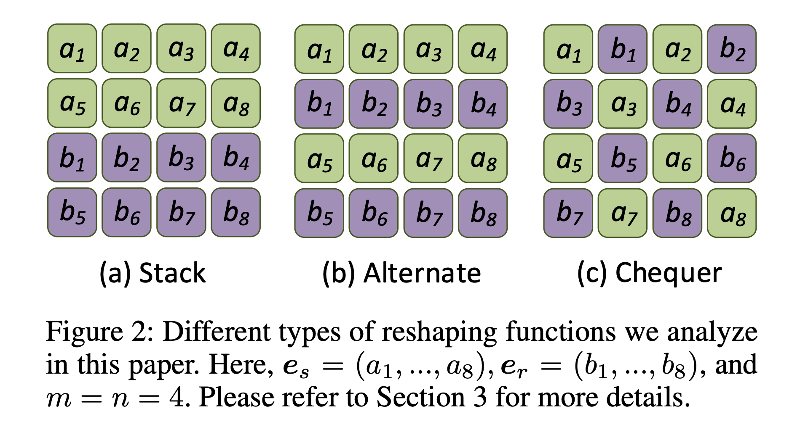
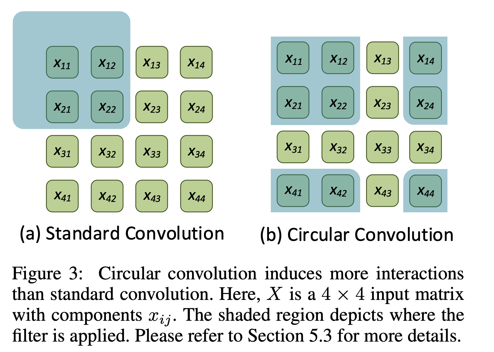
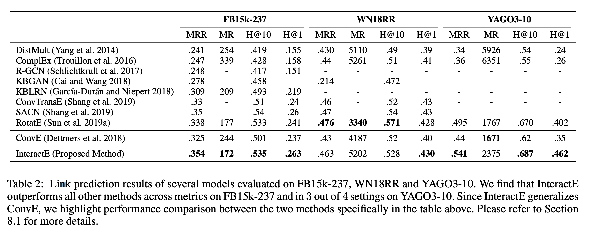

## InteractE: Improving Convolution-based Knowledge Graph Embeddings by Increasing Feature Interactions
### Shikhar Vashishth, Soumya Sanyal, Vikram Nitin, Nilesh Agrawal, Partha Talukdar
### AAAI 2020 [[arXiv](https://arxiv.org/pdf/1911.00219.pdf)]

**Whats New** Existing KG suffers from incompleteness, this paper propose a technique for link prediction task using three key contributions, feature permutation, feature reshaping and circular convolution. It gives SOTA performance.

**Key Contribution**
1. InteractE, a method to extend the expressive power of ConvE through feature permutations, "checkered" feature reshaing and circular convolution.
2. How interactions are increased in InteractE, and correlation between hetrogenous interactions and link prediction performance.

**How It Works**
* Context: ConvE

    * e_s dash, and e_r dash  are 2D reshaping of e_s and e_r
    * star denotes the conv operations

* Reshaping: As we can see, e_s and e_r can be reshaped into 2D metrics, with following three thechniques.

    

        
        <em>Source: Author</em>
        

* Interaction: It the number of possible triples, (x, y, M_k), where M_k is subset of reshaped 2D metric depending upon the kernel size, and x and y are elements of reshaped 2D metric. 
    * Interaction is hetrogeneous if x \in e_s, and y \in e_r.
    * Interaction is homogenous if both belongs to either e_s or e_r.
    * Note, in chequered reshaping there are maximum numbers of hetrogeneous interactions.

* Circular Convolution
    * With modulo operation it finds the elements to be convoluted. 
    

        
        <em>Source: Author</em>
        

* Results:
    * Ablation study has shown that chequered reshaping and cicular convolution has given better accuracy.
    * On three datasets, it has produced better results then ConvE and RotatE, and other latest techniques.
    * MRR: mean reciprocal length, MR is the mean rank, H@10 is hit at 10, and H@1 is hit at 1.

    

        
        <em>Source: Author</em>
        

