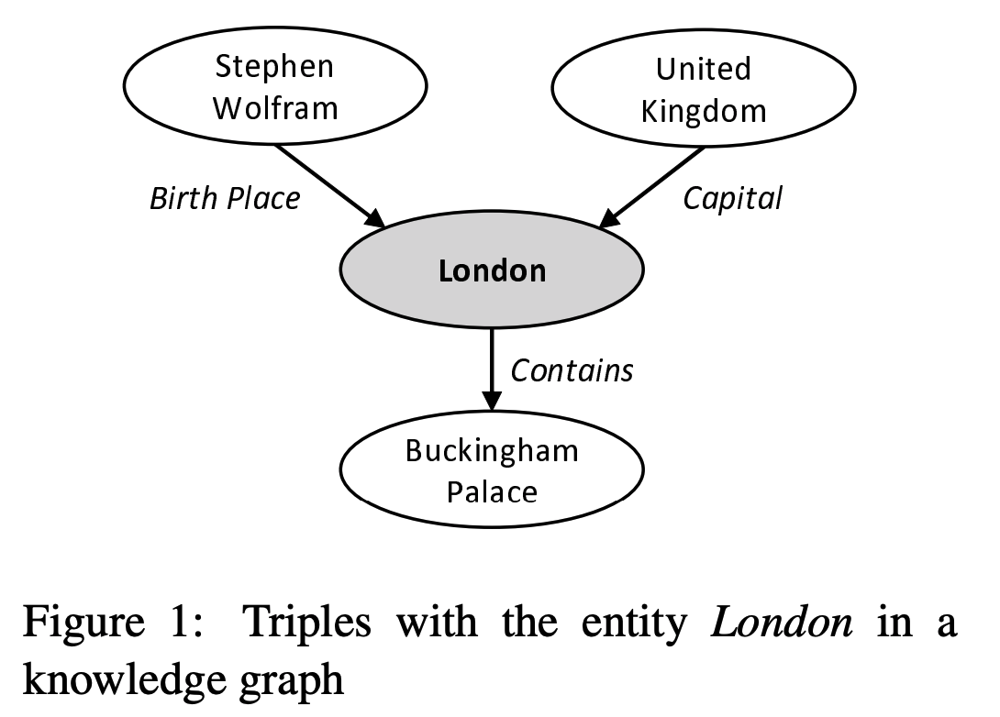
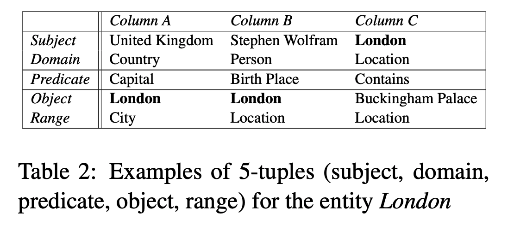
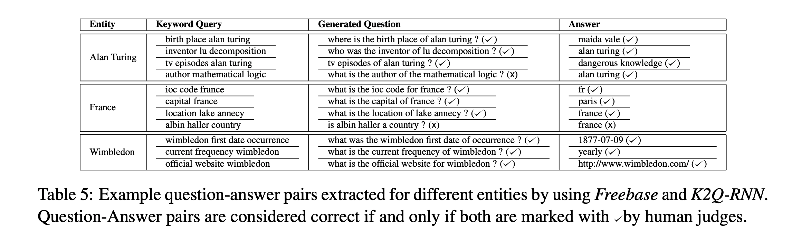

## Generating Natural Language Question-Answer Pairs from a Knowledge Graph Using a RNN Based Question Generation Model
### Sathish Indurthi, Dinesh Raghu, Mitesh M. Khapra and Sachindra Joshi. 
### ACL 2017 [[arXiv](https://www.aclweb.org/anthology/E17-1036.pdf)]

**Whats New**
This paper present an approach to generate an unique answer question, by selecting unique forward or backward relation and LSTM based question generator using the extracted triples.

**How It Works**
* Extend KG trips to 5-tuple from knowledge graph as follow:
- Subject
- Domain(predicate) or Subject Type
- Predicate
- Object
- Range(predicate) or Object Type

    
    <em>Source: Author</em>
    

    
    <em>Source: Author</em>
    

* Unique forward relation: If predicate (realtion) is unique for the subject, then include subject, predicate, and range(predicate) => object
* Unique backward relation: If predicate (relation) is unique for the object, then include object, predicate, domain(subject) => subject

* RNN based Natural Language Question Generation
    - Given the question keywords, model needs to generate the natural language questions.
    - Set of keywords in input are in sequence, they are not bag of words
    - WikiAnswers dataset is used, which has 20M questions, and author have randomly selected 1M questions. 
    - nouns, verbs and adjectives were kept as keywords.
    - Freebase was used as knowledge graph, where randomly picked 27 different entities of freebase of various types (i.e. person, location, organisation etc)
    
* Evaluation
    - BLEU score was used to measure performance of generated questions using LSTM model
    - Human evaluation was also done.
* Results - We can see examples of generated questions as below

    
    <em>Source: Author</em>
    

