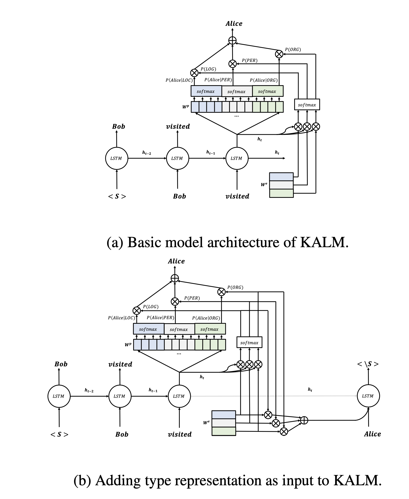
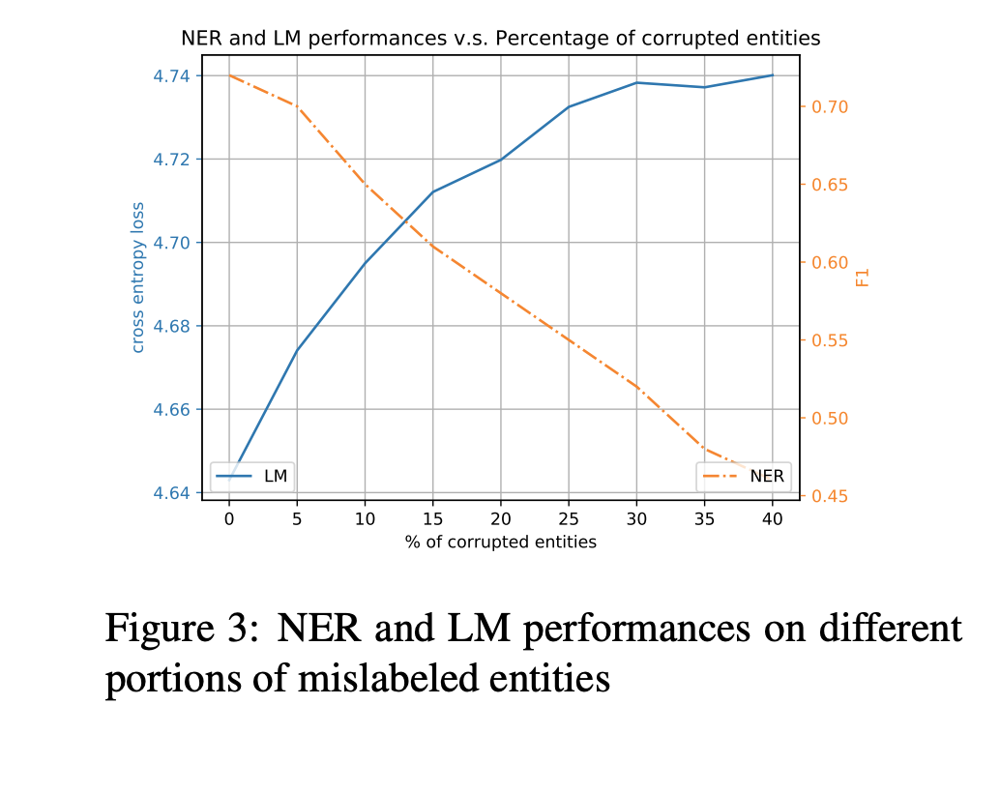

## Knowledge-Augmented Language Model and Its Application to Unsupervised Named-Entity Recognition
### Angli Liu, Jingfei Du, Veselin Stoyanov
### Facebook AI
### NAACL 2019

**Whats New** This paper presents augmentation method in generative langugage model, which learns latent entity types, and leverages external knowledge bases in unsupervised fashion. 

**How it works**
* In RNN setup, to predict the next word,
    * It needs to predict the probability of next word, 
    
    * Which is probability of word given type multiplied by probability of type given hidden state. Ofcourse the weighted sum across all the types. 

    

    * Probability weighted type embedding vector will be concatenated to generated word, as it would carry forward type information in it, which will help to predict type of the next word as well.

        

    * Following figure demonstrate it really well
    

        
        <em>Source: Author</em>
        

    * After that it adds three more techniques:
        * for NER tasks it leverages bidirectional context.
        * It also leverage type prior for each entity from external source
        * It uses wikitext-2 data alogn with CoNLL dataset.

    * Loss function trained as below:

        

**Results**
    * In unsupervised way, it gives F1 score of 0.86 for entity types LOC, MISC, ORG, PER in CoNLL 
    * As external knowledge base gets corrupt, its NER perfromance get impacted, as can be seen below:
    

        
        <em>Source: Author</em>
        

