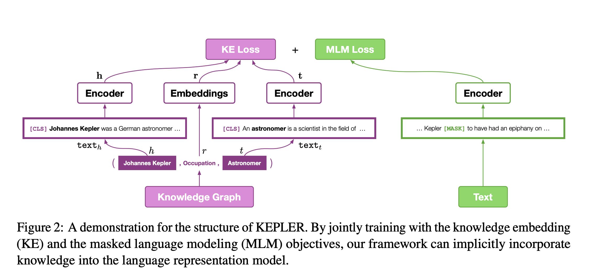
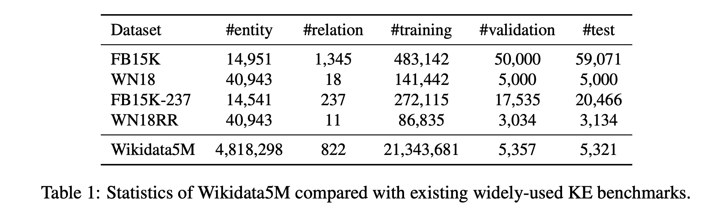

## KEPLER: A Unified Model for Knowledge Embedding and  Pre-trained Language Representation
### Wang et al, 
### Preprint, Feb 2020 [[arXiv](https://arxiv.org/pdf/1911.06136.pdf)]

**Whats New**
This paper proposes "Knowledge Embedding and Pre-trainined Language Representation" method to jointly learn KG and pre-trained LM representations, and it shows its impact on downstream tasks.

**Major Contribution**
Major contribution of this paper is three fold
* Author proposes KEPLER, knolwedge enhanced PLR with jointly optimizing the KE and MLM objectives which brings great improvements on wide range of NLP tasks. 
* By encoding text descriptions as entity embeddings, KEPLER shows its effectiveness as a KE model, especially in an inductive setting
* Authors introduced a dataset Wikidata5M, a new large-scale KG dataset, which shall promote the research on large scale KG, inductive KG, and the interactions between KG and NLP.

AS a PLM, it achieves following:
* Integrate knowledge into language understanding
* Inherits strong ability of langauge understanding from PLMs by the MLM objective
* KE objective enhances the ability to extract knowledge from the text
* Can be directly adopted to a wide range of NLP tasks without additional infernece overhead

AS a KE model
* Can better utilises the abundant information from entity descriptions
* Inductive in nature, can generate entity embeddings in inductive fashion from entity descriptions

**How it works**
* Following figure illustrates the process really well
    

        
        <em>Source: Author</em>
        

* KF loss is inspired from RotateE/tansE, 

    
    * Where, h is head entity, t is tail entity and dr is a score function given head, tail and relation r. lambda is a margin.

    * Following score function is used.

    

    * Head and Tail embeddings are embeddings of CLS token of their description.

Wikidata5M dataset comparision with other datasets are as below:
    

        
        <em>Source: Author</em>
        

Experiments:
* It has used following different models
    * Kepler-Wiki
    * Kepler-WordNet
    * Kepler-Wiki+WordNet

* And it has proven its value addtion on following kinds of NLP tasks
    * Relationship classification: classify the relationship type between two given entities
        * TACRED
        * FewRel

    * Entity Typing: Classify given entity mentions into pre-defined types
    * GLUE
    * Link Prediction in transductive setting and inductive settings

