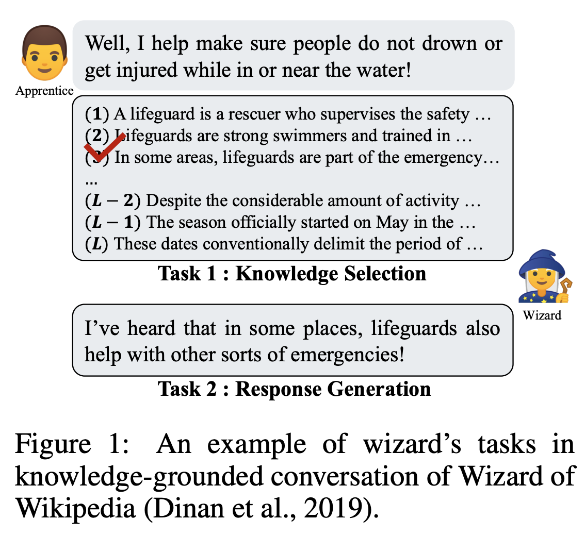
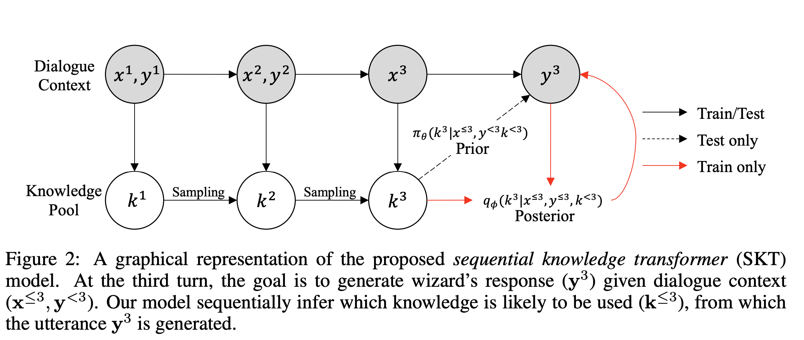

## SEQUENTIAL LATENT KNOWLEDGE SELECTION FOR KNOWLEDGE-GROUNDED DIALOGUE
### Byeongchang Kim, Jaewoo Ahn, Gunhee Kim
### Seoul National University
### ICLR 2020

**Whats New** This paper focus on "knowledge selection" to improve multi turn knowledge grounded dialogue. It presents the model named "Sequential Knowledge Transformer" can keep track of prior and posterior distribution over knowledge. 

**Underlying Task** Knowledge grounded task of Wizard of Wikipedia can be seen in below figure.

    
    <em>Source: Author</em>
    

Wizard is expected to be both knowledgable and engaging in conversation.

**How It Works**

* Graphical representation of Sequential Knowledge Transformer can be seen as below:

    
    <em>Source: Author</em>
    

* Notations:
    * 1 ≤ t ≤ T to iterate over dialogue turns
    * 1 ≤ m ≤ M and 1 ≤ n ≤ N to respectively for utternance of apperantice and wizard
    * 1 ≤ l ≤ L to denote knowledge sentences in the pool
    * Hence, 
    * x1, ..., xt: utterances from apprentice x
    * y1, ..., yt: utterances from wizard y
    * k1, ..., kt: the knowledge pool, where kt = { k_t,l } for l = 1,..,L

* Sentences are encoded using BERT average pooling
    * uttenrence y^t-1 is encoded as h_y^t-1
    * apprentice-wizard utternence pair h_xy^t = [h_x^t, h_y^t], and GRU layer represents that as d_xy^t = GRU_dialog(d_xy^t-1, h_xy^t)

         

    * Where, 
    * q_phi is posterior knowledge from turn 1 to t-1
    * pi_theta is prior knowledge at turn t, estimated based on x_<=t, and y_<t

        

    * As, we can see, prior probability is just the dot product of W_prior . [d_xy_t-1, h_x_t] . [h_k^t_1, .. h_k^t_L], where d_xy_t-1 is the result of GRU state.
    * Posterior probability is the dot product of W_posterior . [d_xy_t] . [h_k^t_1, .. h_k^t_L], where d_xy_t-1 is the result of GRU state.

    * During decoding, it uses copy mechanism to maximize the effect of selected knowledge for response generation. So, either it copies or it generate the word based on a sigmoid over a hyper parameter.

    * Training loss is combination of perplexity and KL divergence between posteriori and priori.

* Results:
    * It has achieved state of the art results in metrics - unigram F1, bigram F1 and perplexity. 

