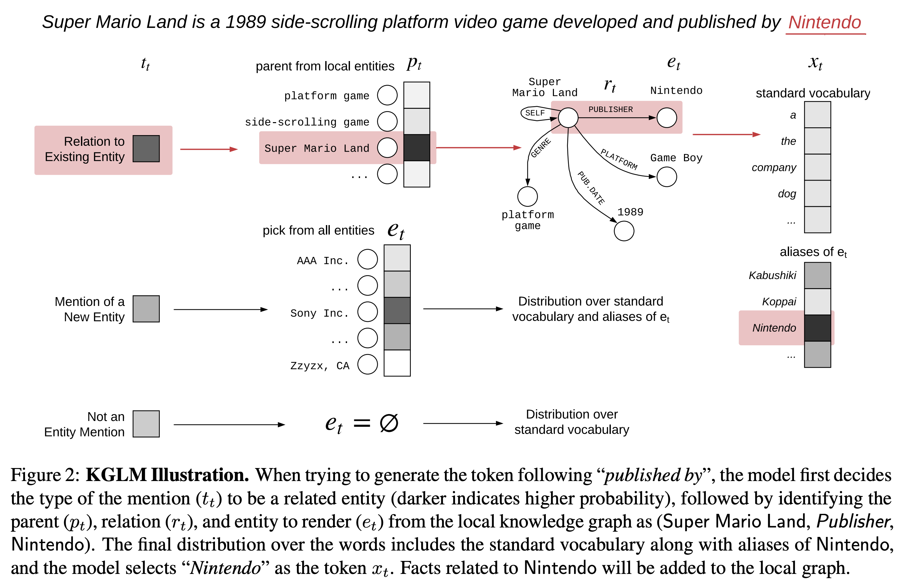
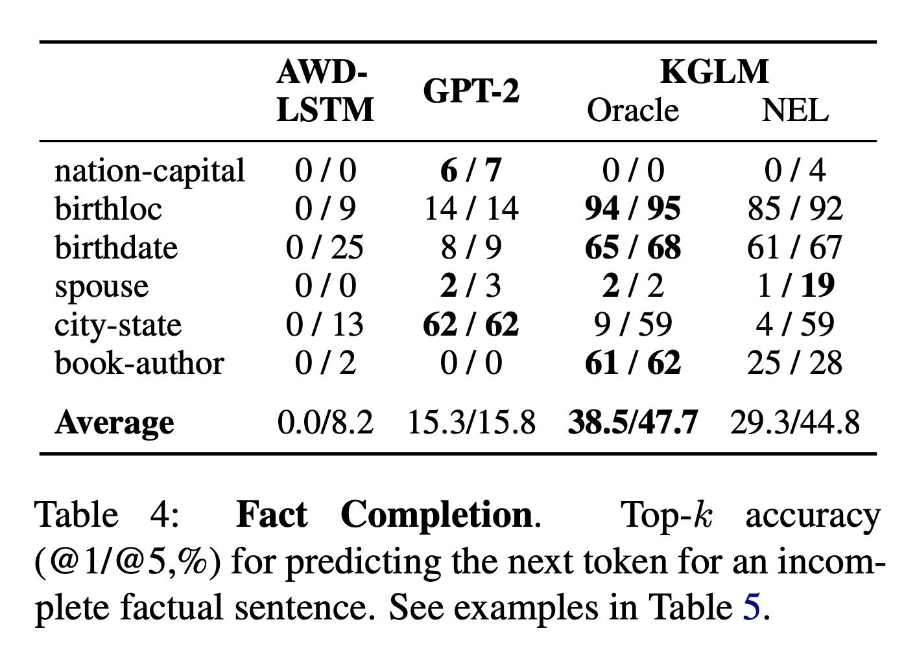

## Barack’s Wife Hillary: Using Knowledge Graphs for Fact-Aware Language Modeling
### Robert L. Logan IV, Nelson F. Liu, Matthew E. Peters, Matt Gardner, Sameer Singh
### ACL 2019

**Whats new** This paper presents a novel KGLM Knowledeg Graph Langauge Model which has capability to select and copy facts from Knowledge Graph while generating language.

**Key Insights**
* Generally, language model learns the probability of popular patterns and it mimicks them. 
* Typically, facts presents in knowledge graph might not be redered by language models because of data scarcity problem
* That creates the opportunity to assist langauge model to select info from KG while generating the text.

**How it works**
* RNN Langauge models parameterise the distribution as follow
 

* A knowledge graph (KG) is a directed, labeled graph consisting of entities E as nodes, with edges defined over a set of relations R.

* Local graph till token t is also defined as 

* Formally, KGLM computes p(x_t, E_t | x<t, E<t). Following diagram illustrates it really well.
    

    
    <em>Source: Author</em>
    

    * Decide the type of x_t, denoted by t_t, it can be "new", "related", or "phi" (not an entity mention)
    * If t_t is "new": choose the upcoming entity e_t from all KG entities
    * If t_t is "related": choose the parent entity p_t, relation r_t , and an entity e_t based on p_t and r_t.
    * If t_t is "phi", then e_t = "phi"
    * If e_t does not belong to E<t, then add e_t into E<t, and make it E<t+1

* Parameters are chosen as below to achieve the same
    * Hidden state is chosen as 
    
        
    * t_t = softmax(h_t,x, {new, related, phi})
    * New entity is chosen as: 

        

    * Parent entity, and relation is chosen as:

        

        * and, 
        
        

    * Whenever, and entity is selected, it influence the distribution over vocabolary to generate new token, i.e. 
    
        

    * Training KG Embeddings, i.e. v_et, These are pretrained using TransE. 

        * 

    * And, objective function of negative loglikelihood is minimized, 

        

* Annotations in the dataset can be understood as follow:
 

    
    <em>Source: Author</em>
    

* Results: This clearly shown much improvement to generate factual information in comparison to GPT2 etc. Test dataset aiming to generate factual information like national capital, birthloc, birthdate, spouse, city-state, book-author was compared using baseline, GPT2, and KGLM, and following results were achieved.

 

    
    <em>Source: Author</em>
    

**Reflection** Indeed, one of the good paper aiming to integrate KG with LM really well. How it fairs to transformer, it would be really good to observe. Learning both language model, and KG from same text, integrating them while generating or question answering etc would be interesting to know.

