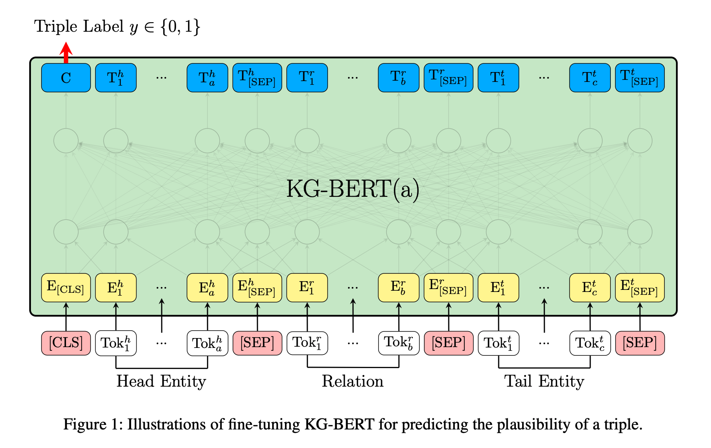
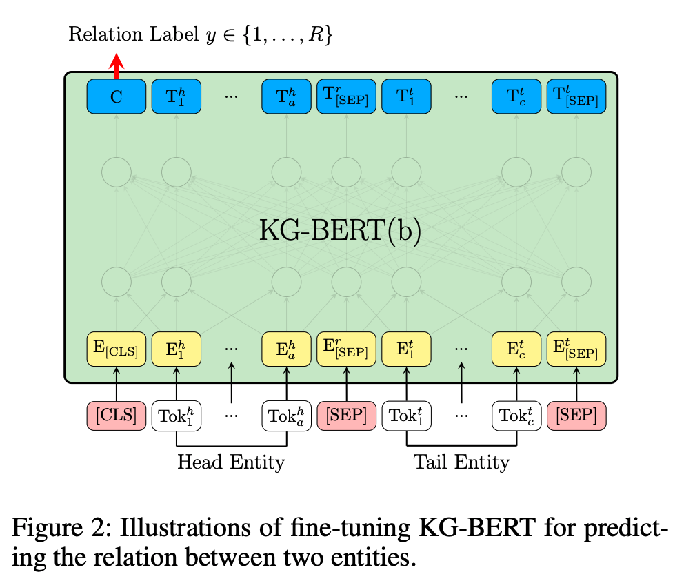
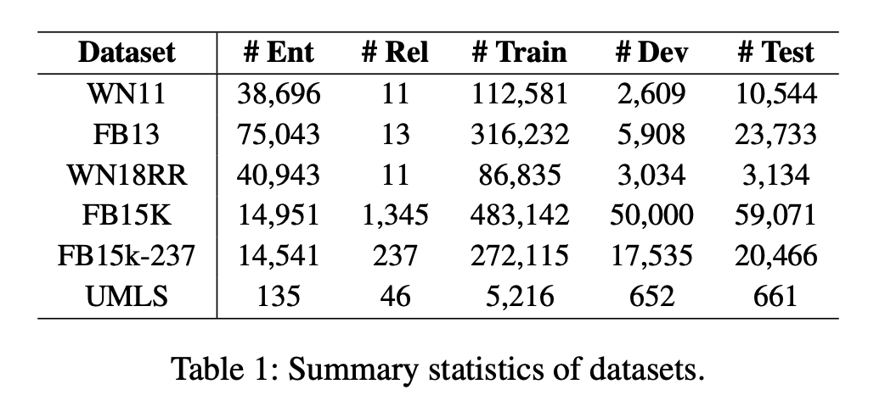

## KG-BERT: BERT for Knowledge Graph Completion
### Liang Yao, Chengsheng Mao, Yuan Luo
### AAAI 2020 [[arXiv](https://arxiv.org/pdf/1909.03193.pdf)]

**Whats New**
This paper applies BERT on KG tasks, like triplet classification, link prediction, and relation prediction, and it achieves state of the art or comparable results.

**How It Works**
Three KG tasks are as follow:
* Triplet classifcation: (h, r, t) => 0 or 1
* Link prediction: (h, r, ?) => t, (?, r, t) => h
* Relation prediction: (h, ?, t) => r

* Triplet classification and link prediction are solved using following architecture

    

        
        <em>Source: Author</em>
        

* Relation prediction is solved using following variant architecture.
    

        
        <em>Source: Author</em>
        

* Binary corss entropy loss for Triplet classifcation and link prediction.

     

    * Where, CLS token is projected to s_t_0 and s_t_1 using W \in R^{2 x H}

* Cross entropy loss is used for relation prediction

    

    * CLS token is projected to s'_t_i where i \in R relations.

* Link prediction is very very slow, because for (h, r, ?), score would be computed for each entitiy considered as tail entity, similarily for (?, r, t)

**Results**
* It has used following databases:
    * WN11: WordNet 11, and FB13: Freebase 13 contains positive and negative triplets, so it is used for triplet classification.
    * WN18RR, FB15K, FB15K-237 only contain correct triplets, so it is used for link and relation prediction.
    * Summary of these datasets are as below:
    

        
        <em>Source: Author</em>
        

* It achieves state of the art results for triplet classification.
* For link preditcion, it achieves SOTA results for mean rank metric, but less than the best results for MRR
* It acheives state of the art results for relation predictions

