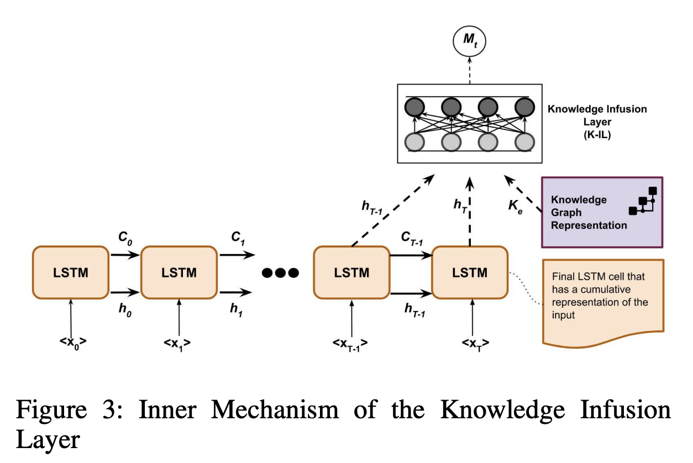
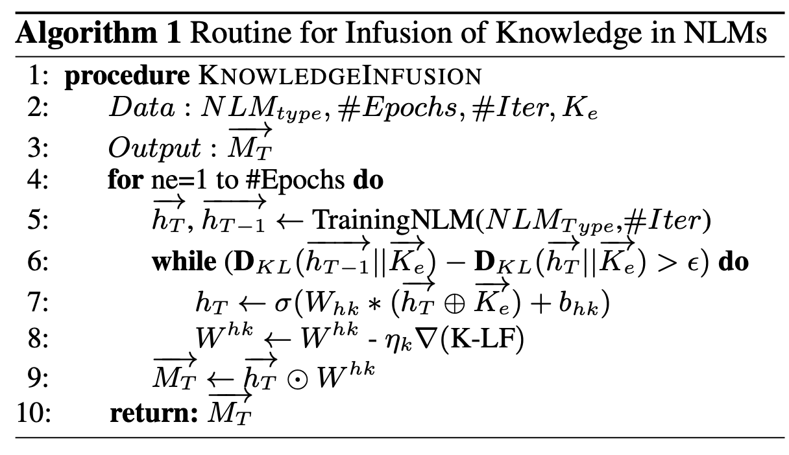

## Knowledge Infused Learning (K-IL): Towards Deep Incorporation of Knowledge in Deep Learning
### Ugur Kursuncu, Manas Gaur, Amit Sheth 
### AAAI 2020

**Whats new**
This paper is a poisiton or a framework paper which demonstrate the need of two extremes to merge, conceptual and probabilistic representations. Which can be thought as bottomup deep learning with top-down symbolic computing. 

**Underlying concepts**
* ML systems are probablistic in nature, and it poses fundamental challange because of its relaince on underlying training data, statistical significance of the patterns present in it. Because of which it can end up generating false alarm, or it can missout on obvious settings. These challanges are broadly classified as follow:
    * dependency on large datasets 
    * bias in dataset
    * sparsity of the data
    * lack of explainability
    * convergence information
    * complexity of architecture
    * false alarms

* This poistion paper answers mainly following:
    * How do we decide whether to infuse knowledge or not
    * How to merge latent representations between layers
    * How to propagate the knowledge through the learned latent representation?

**How it works**
* KG embeddings can be thought as representation concepts enriched by relationships.
* Knowlege infusion:
    * After each epoc, KG knowledge would be infused
    * It has mainly two constituent:
        * Knowledge-Aware Loss Function: It is to minimise D_KL of h_T vs K_e, such that difference between D_KL of h_T and h_T-1 should be with in threshold (or minimised too). Where, D_KL is KL divergence of hidden representation vs knowlege graph embedding.

        

        * Knowledge Modulation Function:  It merges differntial knowledge representation with the partially learned representation. It need vector space transformation, and its weights have to be learnt as function of differential knowledge.

* Following architecture diagram illustrate the process along with algorithm

    

        
        <em>Source: Author</em>
        

    

        
        <em>Source: Author</em>
        

    

        
        <em>Source: Author</em>
        

**Reflection**
It presents good insights, specifically how KG embedding can be mixed at hidden layer, and how loss function can have convergence critera, and back propogation of hidden representation weights as well as how updated KG embedding loop back in the system, to arrive at an equilibrium.
Although, it would have been great to have implementation, experiments and results along with. 

