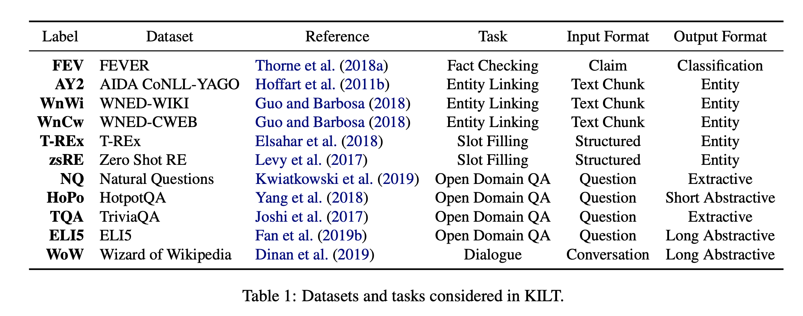
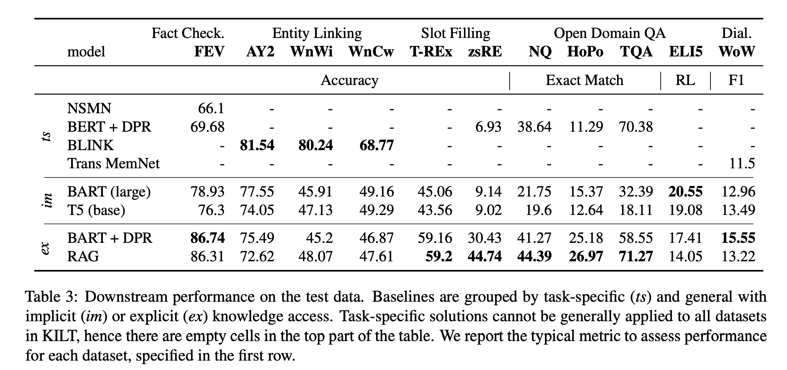

## Kilt: a benchmark for knowledge intensive language tasks.
### Petroni, Fabio, Aleksandra Piktus, Angela Fan, Patrick Lewis, Majid Yazdani, Nicola De Cao, James Thorne et al. 
### arXiv preprint [[arXiv:2009.02252](https://aclanthology.org/2021.naacl-main.200.pdf) (2020).

**Whats Unique**
KILT is a benchmark for knowledge intensive language tasks. It unifies tasks requiring access to knowledge context, i.e. wikipedia pages, like Fact Checking, Entity Linking, Slot Filling, Open Domain QA or Dialogues. 

**How Does It Work**
* It brings around 11 datasets over five different types of tasks under one umbrella.
* It maps wikipedia context required for each record over these 11 datasets examples to a common wiki snapshot
* It provided provinance as the reference, which is sufficient to give/generate answers
* It provides three types of baseline, task specific models, or implicit models (which do not seek retrieved context), or explict models (which access retrieved knowledge)
* Following table gives different datasets and tasks mapped under KILT.

    
    <em>Source: Author</em>
    

* Following table gives baseline performance of various categories of models.

    
    <em>Source: Author</em>
    

* DPR + BART model and RAG models are providing strong baselines.
* It also provide github code access, and library to facilatate easy testing and interfaces.

