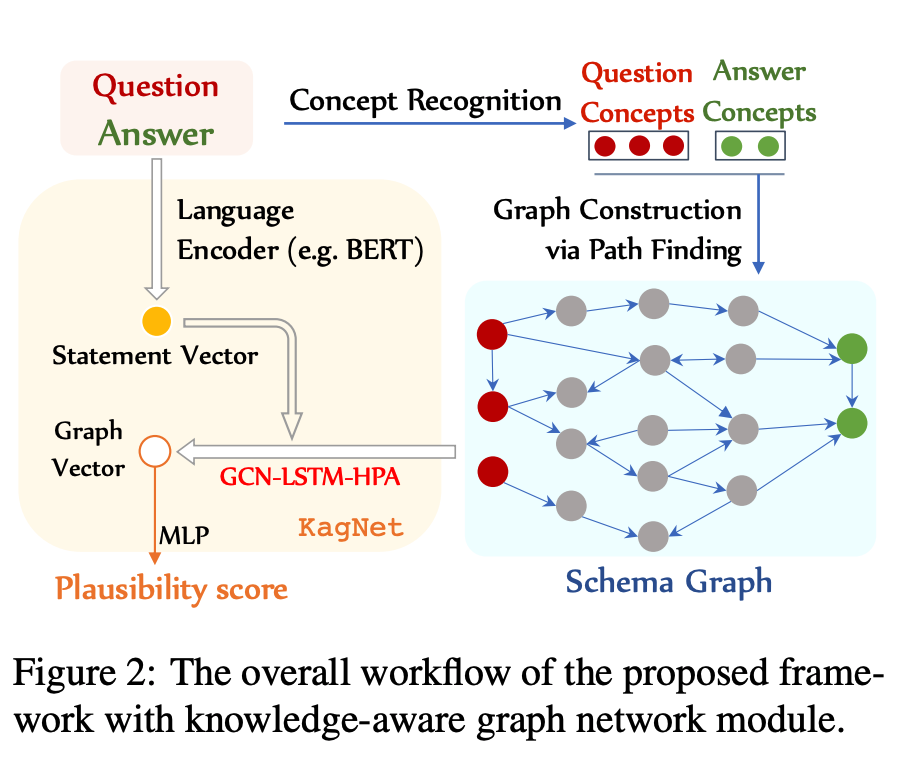
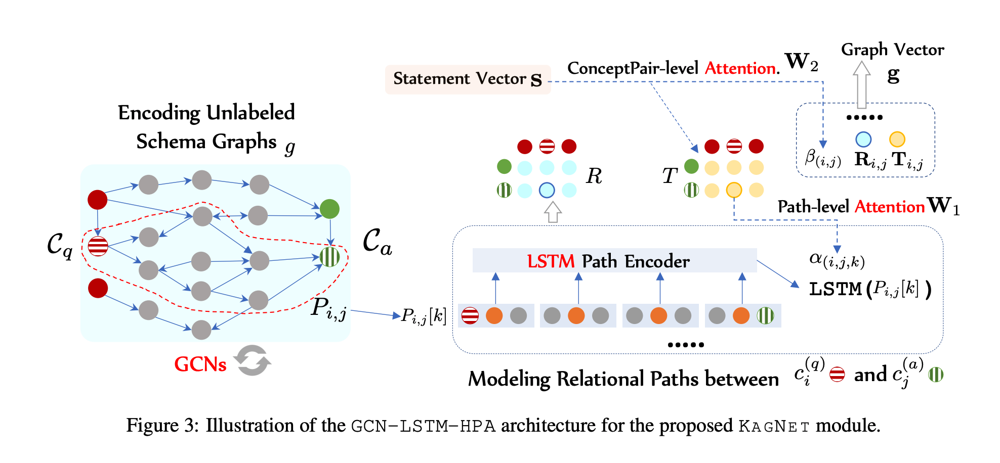

## KagNet: Knowledge-Aware Graph Networks for Commonsense Reasoning
### Bill Yuchen Lin, Xinyue Chen, Jamin Chen, Xiang Ren
### EMNLP-IJCNLP 19 [[arXiv](https://arxiv.org/pdf/1909.02151.pdf)]

**Whats New**
Using ConceptNet as the external knwoledge source, this paper achieves state of the art results on CommonsenseQA dataset, and proposes framework to transform question answers into a subgraph of external knowledge, and arriving decision by applying graph convolutional networks and LSTMs.

**How It Works**
* Commonsense required natural language question q and set of answers N, task is to choose the right answer.
* This involves two modules, 
1) Schema Graph Grounding
2) Graph Modelling Infernce
* Following figure illustrates it neatly
    

    
    <em>Source: Author</em>
    

* Schema Graph Grounding: It deals with extracting the graph from external knowledge ConceptNet, which requires to determine the plausible answer. The graphs are named "Schema Graphs" inspired by schema theory. It has three substes
    * Concept Recognition: Mentions maching concepts in  Extrenal grpahs are extracted by n-gram comparison, with some rules like soft-matching, lemmatization etc.
    * Schema Graph Construction: One way to find is minimal spanning tree covering the requried concepts identifed in step 1. This is NP-Complete problem to find "Steiner tree problem". Authors proposed a straightforward algo, to find paths among mentioned concepts (shorter than k).
    * Path pruning: ConceptNet is trained with ConvE, and path are decomposed in to triplets, and each triples is scored by ConvE. Triplets constituting a path are multipled to find the score of a path, and it is pruned if it is less than some threshold.

** Knowledge Aware Graph Network
    
* It applies GCN to tune embeddings for concept nodes in the context of extracted sub graph.
    
* Relation Path Encoding:
    
    * Path k between question concept node i, and answer concept node j is a sequence of triplets, 

        

    * Latent representations of all the paths between Question concept i and Answer concept j is, 

        

    * Latent representation of sentence (question + answer), and question concept i, and aswer concept j is 

        

    * g, graph representation, is the average pooling of all pairs i, j for all-path-representation and direct-representation of question concept i and answer concept j. 

    * We can get the score with 
        * score(q, a) = sigmoid(MLP(g))

* Hierarchical Attention Mechanism
    * Concept-pair-path level attention
        * It is applied to get thre represetnation of all paths for a concept pair.
            

    * Concept-pair level attention
        * It is applied to get the graph represenation.

            
* Following figure illustrate the above steps:
    

    
    <em>Source: Author</em>
    

**Results**
* It gives a table to compare performance at 10%, 50% and 100% of training data.
* It gives a marginal improvement of around 1% for BERT-finetuning methods
* It gives ablation study to back up design choices.

 

