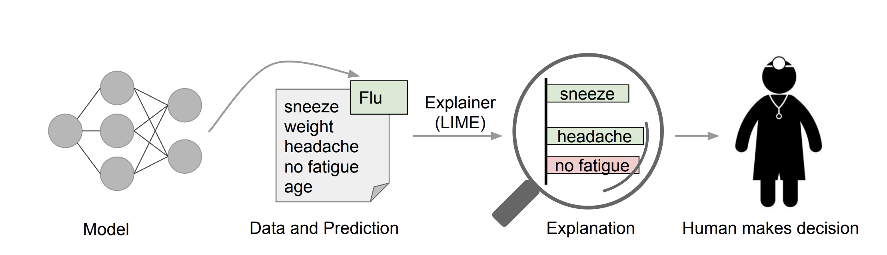
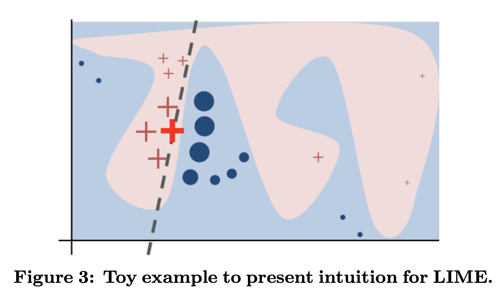

## LIME: “Why Should I Trust You?” Explaining the Predictions of Any Classifier
### Marco Tulio Ribeiro, Sameer Singh, Carlos Guestrin 
### University of Washington
### KDD

**Whats New**
This paper presents unique way of explaining a prediction, by demonstrating feature importance, and also explaining the model by ranking features based on its global importance, aggregated over predictions on diverse set of instances.

**Intuition**
* Explanation labels leads to faithfulness on the model
    

    
    <em>Source: Author</em>
    

**Hypothesis**
* Any instance of features can be reduced to simple instance, i.e. marking presence or absence of a feature
* Simple instance can be used to predict outcome in locality with interpretable classifier like linear regression, logistic regression etc.
* Local classifier over a simpler instance would give feature importance, which can serve as explanations
* Aggregating features imporatance over dataset would give global importance

**Problem Formulation**

* Idea is to select a simple explainable function which can estimate prediction in locality, g. 
* For each instance, x, its explaination model, g, which generates predictions similar to actual model f over locality defined by kernel \pi_x, and \omega(g) is the complexity of generated explanations, i.e. it can correspond to depth of the tree if g is a decision tree, or non zero coefficients if its logistic regression.

    

    

* Figure below, gives a good intuition
    

    
    <em>Source: Author</em>
    

    * Blue and Pink region are seperated by a global model f.
    * The bold red cross is the instance being explained
    * The locality weights generated by kernel \pi_x is demonstrated by size of cross or circles.
    * Local function over simplified input representation is learnt as linear dashed boundary.

* Experiment Setup and Testing method
    * Are explanation faithful to model?
        * Actual model is selected to be interpretable, i.e DT and Sparse Logistic Regression
        * Overall, gold set of features are derived, by keeping constraint that maximum numbers of features to be used per instance is 10. 
        * For each prediction on test set, explanations are generated, and how many gold features are covered is computed as model's faithfullness.
        * LIME performs much better than Parzen, Greedy and Random approach. 
    * Should I trust prediction?
        * Randomly 25% of features are labelled as "untrustworthy"
        * Gold labels are created for trustworthiness. If black box classifer changes its predictions if we remove untrustworthy features then it is marked as "untrustworthy", and "trustworthy" otherwise.
        * If local function changes predictions after removing "untrustworthy" features, then prediction is predicted as "untrustworthy"
        * Accuracy of labelling predictions "untrustworthy" is computed. Higher accuracy denotes that local function is able to capture features impact well.
        * LIME performs much better than Parzen, Greedy and Random approach. 
    * Can I trust this model?
        * Random noise features were added.
        * Two different classifier with similar validation accuracy but different test accuacy are trained.
        * Random noise features are marked as "untrustworthy"
        * Using explanations, better classifer having more trustworthy features are selected.
        * And, hence it was able to retrive the better classifer.

