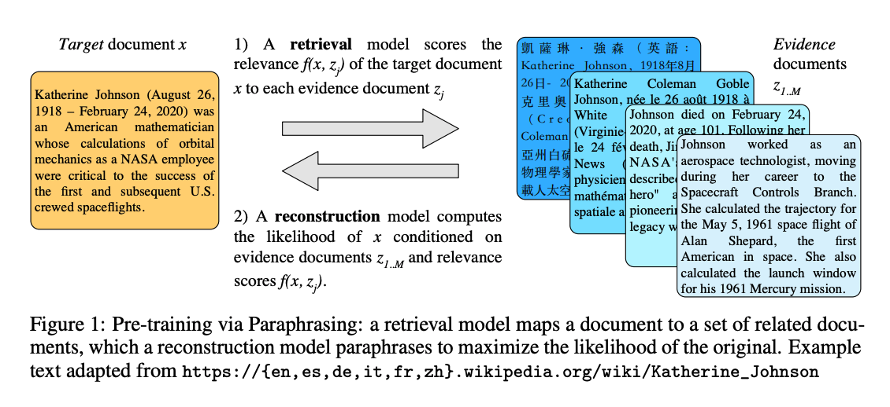

## "MARGE: Pre-training via paraphrasing."
### Lewis, Mike, Marjan Ghazvininejad, Gargi Ghosh, Armen Aghajanyan, Sida Wang, and Luke Zettlemoyer.
### 2020, [arXiv](https://arxiv.org/pdf/2006.15020.pdf)

**Whats Unique**
This paper presents a new alternative pre-training procedure which is best suited at task like para phrasing, translation, and summarisation. It has two model relevance and reconstruction. The Attention bias in reconstruction model comes through relevance model, hence back propogation is also able to train relevance model alongside. 

**Motivation: Pretraining via Paraphrasing**
* It has multi-lingual multi-document paraphrasing objective.
* Objective funciton is to reconstruct the target text by retrieving the similar text from multiple documents.
* It is possible to jointly learn reconstruction and retreival through attention mechanism.
* The objective captures the aspect of translation, summarisation, paraphrasing and retrieval. 

    
    <em>Source: Author</em>
    

**Approach**
* Cosine Similarity score between target text and evidence text:

* We would need to minimize the negative log likelihood of the target document, given similarity and evidence documents.
* Its an auto-encoder type of loss where we need to generate target document from evidence and information bottleneck created because of similairy score.

* Attention mechanism would also have a bias of similairity score, so it would also alter or learn the similarity scoring by tweaking the embeddings.

* With around 1B parameters, it took 4700 GPU days to pretrain a model, which would be better suited for translation, summarisation, paraphrasing etc objectives.
