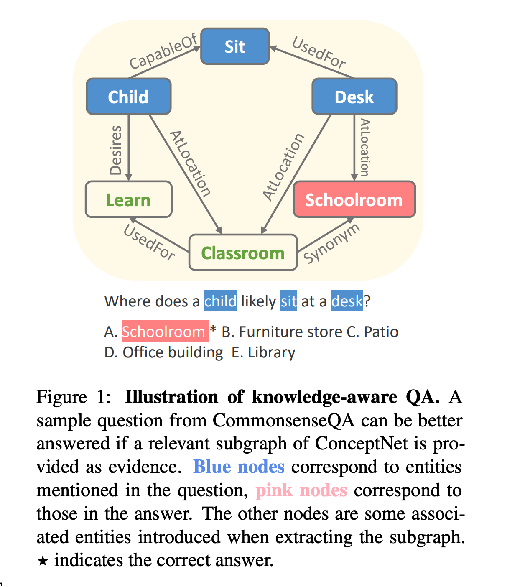
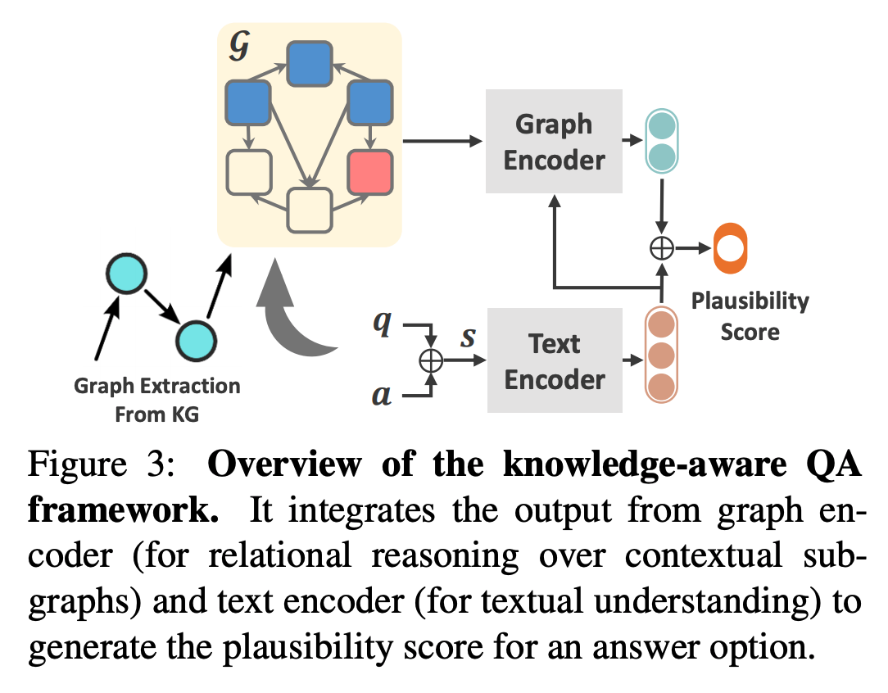
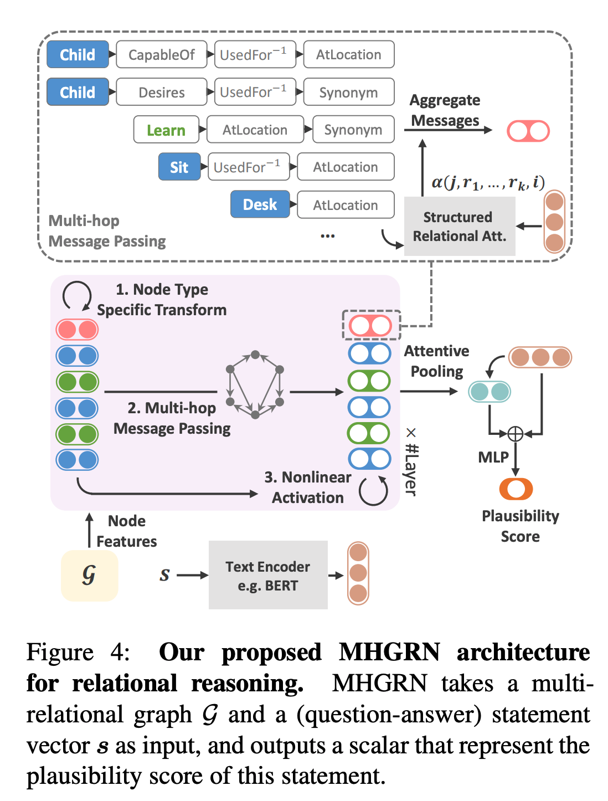

## Scalable multi-hop relational reasoning for knowledge-aware question answering
### Feng, Yanlin, Xinyue Chen, Bill Yuchen Lin, Peifeng Wang, Jun Yan, and Xiang Ren. 
### arXiv preprint [[arXiv:2005.00646](https://arxiv.org/pdf/2005.00646.pdf)] (2020).

**Whats Unique**
This paper presnet's knowledge aware commonsense answering technique, where it combines infusing knowledge over multi-hop paths with GNN approch. It uses ConceptNet to get the subgraph and infuse it on MultiHop datasets like CommonsenseQA and O    penBookQA.

**Motivation**
Following example shows the motivation for the problem, where how ConceptNet can be used to solve a multi-hop problem.

    
    <em>Source: Author</em>
    

**Overview** of current knowledge aware QA systems is as follow:

    
    <em>Source: Author</em>
    

There are mainly two types of models, GNN and Pathbased. This paper aims at leveraging both these techniques.

**Architecture**
Architecture of MHGRN is shown below in the figure. 

    
    <em>Source: Author</em>
    

First, subgraph is obtained from the ConceptNet by looking up all the nodes and preserving their relationships.

As can be seen, the representation for the nodes are transformed using the relationships of path (max k). And, final represenation of node is weighted sum of transformed representation as results of multiple paths. 

* Note, W_0^K padding matrix are added, just to make sure the scale of final representation remains similar.

Final representation is, weighted sub from all differnt path,

MHGRN methods have given perforamnce gain on CommonsenseQA, and OpenBookQA tasks.

