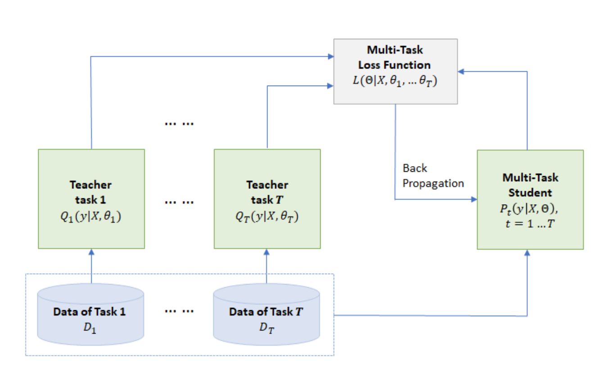

## Improving Multi-Task Deep Neural Networks via Knowledge Distillation for Natural Language Understanding
### Xiaodong Liu, Pengcheng He, Weizhu Chen, Jianfeng Gao1
### 2019

**Whats new** It applies knowledge distillation over ensemble of task specific fine tuned models using multi task DDNs. And, it generates SOTA performance for almost all GLUE tasks.

**Key Insights**
* In the prior paper, authors have demonstrated how Multi Tasks Leanring (i.e. pretraining), and then tasks specific fine tuning delivers better peformance over NLI tasks.
* Independently, it is also known that ensemble of models, always give better performance, but it is difficult to productionise that because of its higher compute and infra requirement.
* Moreover, knowledge distillation is able to shrink model's complexity, as it also learns proabilities of labels, which can be called dark knowledge.
* This paper combines all the three points above to generate MTDNN using Knowledge Distillation, which as expected have outperformed SOTA GLUE metrics.

**Approach**
* It trains 6 MTDNNs using multi task pretraining by varying dropout rates etc parameters. It keeps top 3 of these.
* It trains tasks specific finetuned variantes of these 3 MTDNNs. Ensemble of these task specific models serve as Teacher.
* Mutli task student is trained based on hybrid loss function, 
    * Classic loss funciton:

        

    * Q is average proabaility function for a class, based on ensemble model:

        

    * Knowledge Distillation based loss function:
    
        

    * MTDNN_KD uses sum of classic loss function and knowledge distillation based loss function. 

* Its process diagram is illustrated in the figure below:

    

        
        <em>Source: Author</em>
        

**Results**
* It has outperformed on almost all GLUE tasks
* It has also done better on the tasks where it was not MTL pretrained
* It was able to learn performance of ensemble model effectively.

**Critic Reflection**
* It has thoughtfully mixed three techniques together. 
* In general, it can be further investigated what are different ways of generating ensemble models. 
    * i.e. drop out was used by authors, but other strategies can be explored.
    * MTL pretraining and task specific fine tuning is covered here, but beyond that it can be thought further.
* How can we encorportae orhter loss functions like "RTD" in Electra, 

