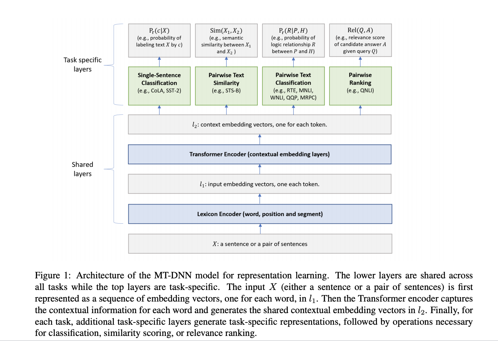

## Multi-Task Deep Neural Networks for Natural Language Understanding
### Xiaodong Liu, Pengcheng He, Weizhu Chen, Jianfeng Gao, 2019

* Two popular approaches to learn vector space representation of text:
    * Multi task learning
    * Language model pretraining

* Multi task learnings enables:
    * Leveraging supervised data across tasks
    * Regularization effect

* Language model pretraining enables:
    * Leveraging large amounts of unlabelled data

* MTDNN combines four types of NLU tasks
    * **Single sentence classification**
        * CoLA: lanugage plasibility
        * SST-2: sentiment of a sentence
        * **Objective**:  
        * **Loss Function**: Cross Entroty
    * **Pairwise text classification**
        * RTE & MNLI: if a sentence is entailment, contradiction, or neurtral
        * QQP & MRPC: semantically equivalent or not
        * Objective: Probability distribution over all the relations between Premise and Hypothesis. More details in paper (Stochasitc Answer Network (SAN), Liu et al, 2018)
        * Loss Function: Cross Entropy
    * **Text similarity scoring**
        * STS-B: semantic text similarity (regression)
        * **Objective**: 
        
        * **Loss function**: Mean Squared Error
    * **Relevance ranking**
        * QNLI: Question answering, rank correct answer option high.
        * **Objective**: 
        * **Loss Function**: Negative Log Liklihood of Positive Examples

* **Architecture of MTDNN can be seen as below**:

<em>Source: Author</em>

    
* **Approach of MTDNN Tranining**
    * Pretraining on BERT
    * Pretraining on task specific batches of all tasks (MTDNN_no_finetune)
    * Fine tuning for a task (MTDNN)

* **Results**:
    * Both MTDNN_no_finetune and MTDNN outperform BERT
    * MTDNN_no_finetune is almost as good as MTDNN with fine tune for large datasets
    * Domain adaptation is faster, u.e. SNLI and SciTail

